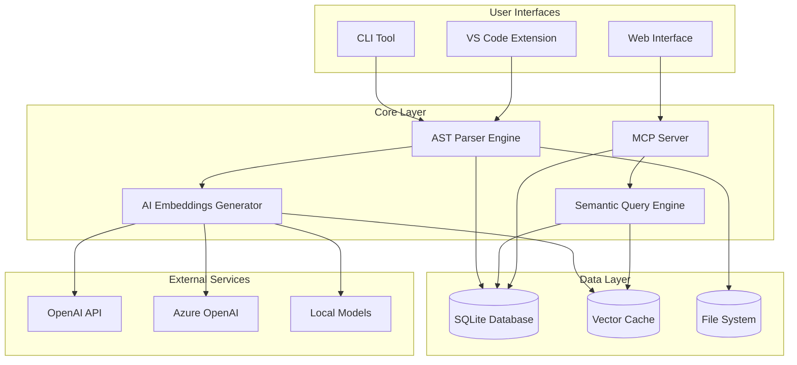
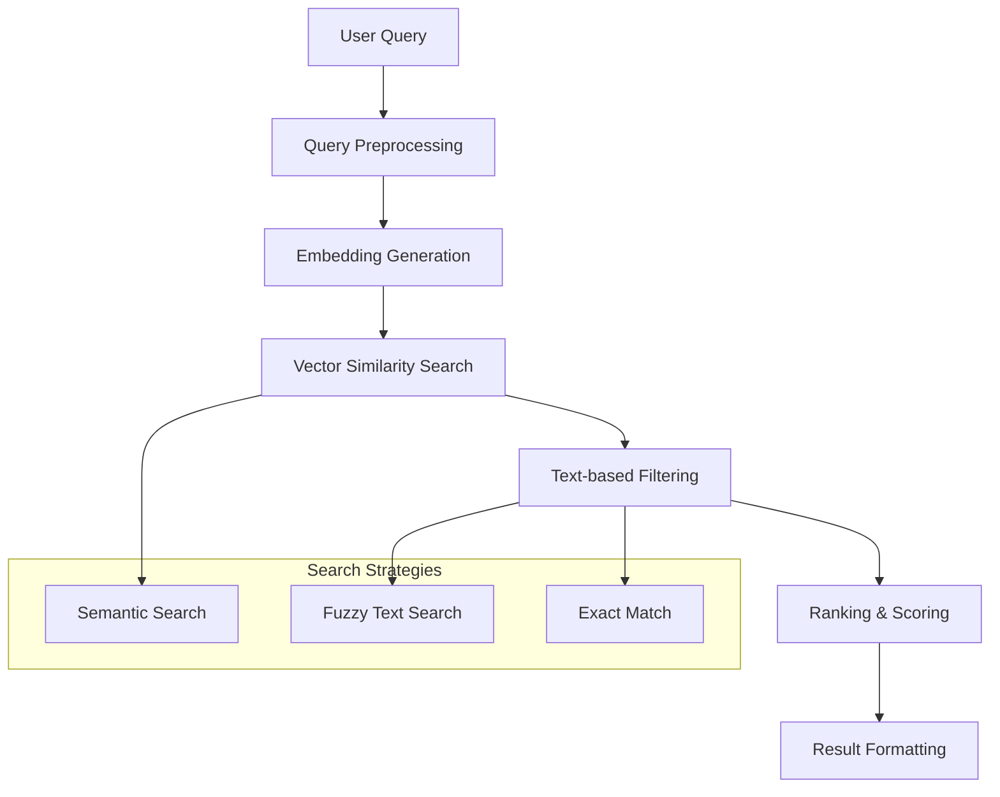
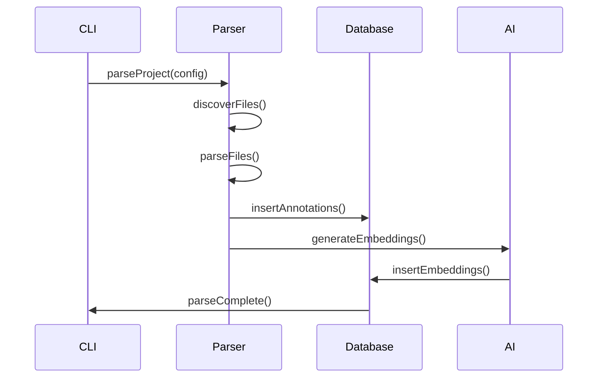
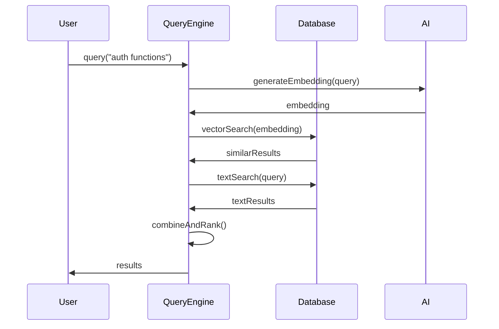
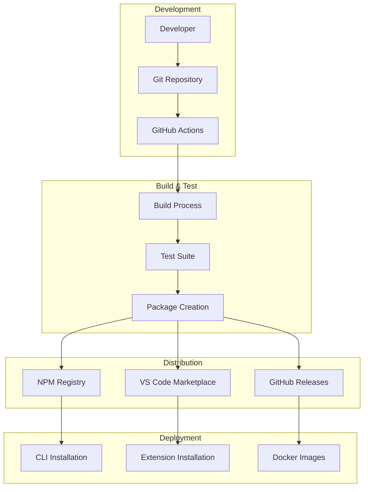
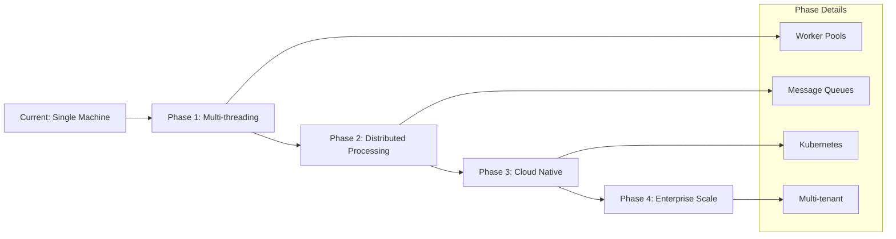

# Architecture Overview

This document provides a comprehensive overview of ast-copilot-helper's architecture, design principles, and technical implementation details for developers and contributors.

## System Architecture

ast-copilot-helper follows a modular, layered architecture designed for scalability, maintainability, and extensibility.

### High-Level Architecture



### Component Overview

| Component                   | Responsibility                               | Technology Stack                     |
| --------------------------- | -------------------------------------------- | ------------------------------------ |
| **AST Parser Engine**       | Parse source code into semantic annotations  | TypeScript Compiler API, Tree-sitter |
| **AI Embeddings Generator** | Create vector embeddings for semantic search | OpenAI API, Sentence Transformers    |
| **Semantic Query Engine**   | Process natural language queries             | Vector similarity, SQLite FTS        |
| **MCP Server**              | Provide AI agent integration                 | JSON-RPC, WebSocket, HTTP            |
| **CLI Tool**                | Command-line interface                       | Node.js, Commander.js                |
| **VS Code Extension**       | Visual Studio Code integration               | VS Code API, Webview                 |
| **Database Layer**          | Persist annotations and embeddings           | SQLite, better-sqlite3               |

## Package Structure

The project is organized as a monorepo with distinct packages:

```
packages/
├── ast-copilot-helper/              # Core CLI package
│   ├── src/
│   │   ├── parser/         # AST parsing logic
│   │   ├── ai/            # AI and embeddings
│   │   ├── query/         # Search functionality
│   │   ├── database/      # Data persistence
│   │   ├── cli/           # Command-line interface
│   │   └── utils/         # Shared utilities
│   └── bin/               # Executable scripts
├── ast-mcp-server/         # MCP server implementation
│   ├── src/
│   │   ├── server/        # MCP protocol handlers
│   │   ├── tools/         # Available MCP tools
│   │   ├── resources/     # MCP resources
│   │   └── transport/     # Communication layers
│   └── bin/               # Server executables
└── vscode-extension/       # VS Code extension
    ├── src/
    │   ├── extension.ts   # Extension entry point
    │   ├── providers/     # Language service providers
    │   ├── views/         # Tree views and panels
    │   └── webview/       # Webview components
    └── resources/         # Extension resources
```

## Core Components

### AST Parser Engine

The parser engine is responsible for extracting semantic information from source code:

#### Architecture

```typescript
interface ParserEngine {
  // Core parsing interface
  parseFile(filePath: string): Promise<ParseResult>;
  parseContent(content: string, language: string): Promise<ParseResult>;

  // Batch processing
  parseProject(config: ProjectConfig): Promise<ParseResult[]>;

  // Language support
  getSupportedLanguages(): Language[];
  registerLanguage(language: Language): void;
}

interface ParseResult {
  annotations: ASTAnnotation[];
  errors: ParseError[];
  metadata: FileMetadata;
}
```

#### Language Support

Each language has a dedicated parser implementation:

```typescript
// TypeScript Parser
class TypeScriptParser implements LanguageParser {
  parse(sourceFile: ts.SourceFile): ASTAnnotation[] {
    const visitor = new TypeScriptASTVisitor();
    return visitor.visit(sourceFile);
  }
}

// Python Parser (Tree-sitter based)
class PythonParser implements LanguageParser {
  parse(tree: TreeSitterTree): ASTAnnotation[] {
    const visitor = new PythonASTVisitor();
    return visitor.visit(tree.rootNode);
  }
}
```

#### Parser Pipeline


### AI Embeddings Generator

Converts code annotations into vector embeddings for semantic search:

#### Embedding Pipeline

```typescript
class EmbeddingGenerator {
  async generateEmbeddings(annotations: ASTAnnotation[]): Promise<Embedding[]> {
    // 1. Text preparation
    const texts = annotations.map((a) => this.prepareText(a));

    // 2. Batch processing
    const batches = this.createBatches(texts, this.config.batchSize);

    // 3. API calls with retry logic
    const embeddings = await Promise.all(
      batches.map((batch) => this.callEmbeddingAPI(batch)),
    );

    // 4. Caching and persistence
    await this.cacheEmbeddings(embeddings);

    return embeddings.flat();
  }

  private prepareText(annotation: ASTAnnotation): string {
    // Combine name, description, parameters, etc.
    return [
      annotation.name,
      annotation.description,
      annotation.parameters?.map((p) => p.name).join(" "),
      annotation.returnType,
    ]
      .filter(Boolean)
      .join(" ");
  }
}
```

#### Supported Providers

```typescript
interface EmbeddingProvider {
  generateEmbeddings(texts: string[]): Promise<number[][]>;
  getDimensions(): number;
  getModel(): string;
}

// OpenAI Implementation
class OpenAIProvider implements EmbeddingProvider {
  async generateEmbeddings(texts: string[]): Promise<number[][]> {
    const response = await this.client.embeddings.create({
      model: this.model,
      input: texts,
    });
    return response.data.map((d) => d.embedding);
  }
}

// Local Model Implementation
class OllamaProvider implements EmbeddingProvider {
  async generateEmbeddings(texts: string[]): Promise<number[][]> {
    const response = await fetch(`${this.endpoint}/api/embeddings`, {
      method: "POST",
      body: JSON.stringify({ model: this.model, prompt: texts }),
    });
    return response.json();
  }
}
```

### Semantic Query Engine

Processes natural language queries and returns relevant code:

#### Query Processing



#### Implementation

```typescript
class QueryEngine {
  async query(
    queryText: string,
    options: QueryOptions = {},
  ): Promise<QueryResult[]> {
    // 1. Preprocess query
    const processedQuery = this.preprocessQuery(queryText);

    // 2. Generate query embedding
    const queryEmbedding = await this.embeddings.generate([processedQuery]);

    // 3. Vector similarity search
    const semanticResults = await this.vectorSearch(
      queryEmbedding[0],
      options.similarityThreshold || 0.7,
    );

    // 4. Text-based filtering
    const textResults = await this.textSearch(processedQuery, options);

    // 5. Combine and rank results
    const combinedResults = this.combineResults(semanticResults, textResults);

    // 6. Apply filters and limits
    return this.applyFilters(combinedResults, options);
  }

  private async vectorSearch(
    queryVector: number[],
    threshold: number,
  ): Promise<SearchResult[]> {
    // SQLite vector similarity using extension
    const sql = `
      SELECT annotation_id, 
             vector_distance(embedding, ?) as similarity
      FROM embeddings
      WHERE similarity > ?
      ORDER BY similarity DESC
    `;

    return this.db.prepare(sql).all(queryVector, threshold);
  }
}
```

### MCP Server

Implements the Model Context Protocol for AI agent integration:

#### Protocol Implementation

```typescript
class MCPServer {
  private tools: Map<string, MCPTool> = new Map();
  private resources: Map<string, MCPResource> = new Map();

  async initialize(
    capabilities: ClientCapabilities,
  ): Promise<ServerCapabilities> {
    this.registerTools();
    this.registerResources();

    return {
      capabilities: {
        resources: { subscribe: true, listChanged: true },
        tools: { listChanged: true },
        prompts: { listChanged: true },
        logging: {},
      },
    };
  }

  private registerTools() {
    this.tools.set("query_codebase", new QueryCodebaseTool(this.queryEngine));
    this.tools.set("get_file_content", new GetFileContentTool(this.fs));
    this.tools.set("get_function_details", new GetFunctionDetailsTool(this.db));
    this.tools.set(
      "analyze_dependencies",
      new AnalyzeDependenciesTool(this.parser),
    );
  }
}

// Example MCP Tool
class QueryCodebaseTool implements MCPTool {
  constructor(private queryEngine: QueryEngine) {}

  async execute(arguments: any): Promise<ToolResult> {
    const { query, type, limit = 10 } = arguments;

    const results = await this.queryEngine.query(query, {
      type,
      limit,
      format: "detailed",
    });

    return {
      content: [
        {
          type: "text",
          text: this.formatResults(results),
        },
      ],
    };
  }
}
```

### Database Layer

Uses SQLite for efficient storage and querying:

#### Schema Design

```sql
-- Core annotations table
CREATE TABLE annotations (
    id TEXT PRIMARY KEY,
    name TEXT NOT NULL,
    type TEXT NOT NULL,
    file_path TEXT NOT NULL,
    line_number INTEGER,
    description TEXT,
    parameters TEXT, -- JSON
    return_type TEXT,
    source_code TEXT,
    metadata TEXT, -- JSON
    created_at DATETIME DEFAULT CURRENT_TIMESTAMP,
    updated_at DATETIME DEFAULT CURRENT_TIMESTAMP
);

-- Embeddings table
CREATE TABLE embeddings (
    annotation_id TEXT PRIMARY KEY,
    embedding BLOB NOT NULL, -- Vector as binary
    model TEXT NOT NULL,
    dimensions INTEGER NOT NULL,
    created_at DATETIME DEFAULT CURRENT_TIMESTAMP,
    FOREIGN KEY (annotation_id) REFERENCES annotations(id)
);

-- Full-text search
CREATE VIRTUAL TABLE annotations_fts USING fts5(
    name, description, parameters, content='annotations'
);

-- Indexes
CREATE INDEX idx_annotations_type ON annotations(type);
CREATE INDEX idx_annotations_file ON annotations(file_path);
CREATE INDEX idx_annotations_name ON annotations(name);
```

#### Database Interface

```typescript
interface DatabaseManager {
  // Annotations
  insertAnnotation(annotation: ASTAnnotation): Promise<void>;
  updateAnnotation(
    id: string,
    annotation: Partial<ASTAnnotation>,
  ): Promise<void>;
  deleteAnnotation(id: string): Promise<void>;
  getAnnotation(id: string): Promise<ASTAnnotation | null>;

  // Embeddings
  insertEmbedding(annotationId: string, embedding: Embedding): Promise<void>;
  searchBySimilarity(
    vector: number[],
    threshold: number,
  ): Promise<SearchResult[]>;

  // Full-text search
  searchByText(query: string): Promise<SearchResult[]>;

  // Batch operations
  insertBatch(annotations: ASTAnnotation[]): Promise<void>;
  vacuum(): Promise<void>;
}
```

## Design Principles

### 1. Modularity

Each component has a well-defined interface and can be developed/tested independently:

```typescript
// Clear separation of concerns
interface Parser {
  parse(source: string): Promise<ASTAnnotation[]>;
}

interface EmbeddingGenerator {
  generate(texts: string[]): Promise<Embedding[]>;
}

interface QueryEngine {
  query(text: string, options?: QueryOptions): Promise<QueryResult[]>;
}
```

### 2. Extensibility

New languages and AI providers can be added without modifying core code:

```typescript
// Language plugin system
class LanguageRegistry {
  private parsers = new Map<string, LanguageParser>();

  register(language: string, parser: LanguageParser) {
    this.parsers.set(language, parser);
  }

  parse(language: string, source: string): ASTAnnotation[] {
    const parser = this.parsers.get(language);
    if (!parser) throw new Error(`Unsupported language: ${language}`);
    return parser.parse(source);
  }
}

// AI provider plugin system
class AIProviderRegistry {
  private providers = new Map<string, EmbeddingProvider>();

  register(name: string, provider: EmbeddingProvider) {
    this.providers.set(name, provider);
  }
}
```

### 3. Performance

Optimized for large codebases:

- **Parallel Processing**: Multi-threaded parsing and embedding generation
- **Caching**: Aggressive caching of embeddings and parse results
- **Lazy Loading**: Load data only when needed
- **Batch Processing**: Process files in batches to optimize API calls

```typescript
class PerformanceOptimizer {
  async parseInParallel(files: string[]): Promise<ASTAnnotation[]> {
    const chunks = this.chunkArray(files, this.maxWorkers);
    const workers = chunks.map((chunk) => this.createWorker(chunk));

    const results = await Promise.all(workers.map((worker) => worker.parse()));

    return results.flat();
  }

  private createWorker(files: string[]): Worker {
    return new Worker("./parse-worker.js", {
      workerData: { files, config: this.config },
    });
  }
}
```

### 4. Error Handling

Comprehensive error handling with graceful degradation:

```typescript
class ErrorHandler {
  async parseWithRecovery(source: string): Promise<ParseResult> {
    try {
      return await this.parser.parse(source);
    } catch (error) {
      if (error instanceof SyntaxError) {
        // Try to parse with error recovery
        return this.parseWithErrorRecovery(source, error);
      }

      // Log and return partial results
      this.logger.error("Parse failed", {
        error,
        source: source.slice(0, 100),
      });
      return this.createEmptyResult(error);
    }
  }

  private async parseWithErrorRecovery(
    source: string,
    error: SyntaxError,
  ): Promise<ParseResult> {
    // Implement error recovery strategies
    const cleanSource = this.removeProblematicSections(source, error);
    return this.parser.parse(cleanSource);
  }
}
```

## Data Flow

### Parsing Flow



### Query Flow



## Testing Architecture

### Test Structure

```
tests/
├── unit/                    # Unit tests for individual components
│   ├── parser/
│   ├── query/
│   ├── ai/
│   └── database/
├── integration/             # Integration tests
│   ├── cli/
│   ├── mcp-server/
│   └── vscode-extension/
├── e2e/                     # End-to-end tests
│   ├── workflows/
│   └── user-scenarios/
├── performance/             # Performance benchmarks
│   ├── parsing/
│   ├── querying/
│   └── embedding/
└── fixtures/                # Test data and fixtures
    ├── projects/
    └── expected-results/
```

### Testing Strategy

1. **Unit Tests**: Test individual functions and classes
2. **Integration Tests**: Test component interactions
3. **End-to-End Tests**: Test complete user workflows
4. **Performance Tests**: Benchmark critical operations
5. **Snapshot Tests**: Ensure parsing output consistency

```typescript
// Example unit test
describe("TypeScriptParser", () => {
  it("should extract function annotations", async () => {
    const source = `
      function calculateTax(income: number): number {
        return income * 0.2;
      }
    `;

    const parser = new TypeScriptParser();
    const result = await parser.parse(source);

    expect(result.annotations).toHaveLength(1);
    expect(result.annotations[0]).toMatchObject({
      type: "function",
      name: "calculateTax",
      parameters: [{ name: "income", type: "number" }],
      returnType: "number",
    });
  });
});
```

## Security Architecture

### Data Protection

1. **Input Validation**: Sanitize all user inputs
2. **Path Traversal Protection**: Prevent access to unauthorized files
3. **Injection Prevention**: Use parameterized queries
4. **Resource Limits**: Prevent DoS through resource exhaustion

```typescript
class SecurityManager {
  validateFilePath(filePath: string): boolean {
    // Prevent path traversal attacks
    const normalized = path.normalize(filePath);
    return !normalized.includes("..") && this.isWithinWorkspace(normalized);
  }

  sanitizeQuery(query: string): string {
    // Remove potentially harmful characters
    return query.replace(/[^\w\s\-_.]/g, "");
  }

  limitResources(operation: () => Promise<any>): Promise<any> {
    return Promise.race([
      operation(),
      this.createTimeout(30000), // 30s timeout
    ]);
  }
}
```

### MCP Server Security

1. **Authentication**: Token-based authentication for API access
2. **Rate Limiting**: Prevent abuse of API endpoints
3. **CORS Configuration**: Restrict cross-origin requests
4. **Input Sanitization**: Clean all MCP tool inputs

## Deployment Architecture

### Distribution Strategy



### Containerization

```dockerfile
# Multi-stage Docker build
FROM node:18-alpine AS builder
WORKDIR /app
COPY package*.json ./
RUN npm ci --only=production

FROM node:18-alpine AS runtime
WORKDIR /app
COPY --from=builder /app/node_modules ./node_modules
COPY . .
RUN npm run build

# Production image
FROM node:18-alpine
WORKDIR /app
COPY --from=runtime /app/dist ./dist
COPY --from=runtime /app/node_modules ./node_modules
COPY package*.json ./

EXPOSE 3001
CMD ["node", "dist/server/index.js"]
```

## Performance Characteristics

### Benchmarks

| Operation                | Small Project (< 100 files) | Medium Project (100-1000 files) | Large Project (> 1000 files) |
| ------------------------ | --------------------------- | ------------------------------- | ---------------------------- |
| **Initial Parse**        | < 5 seconds                 | 15-30 seconds                   | 1-3 minutes                  |
| **Incremental Parse**    | < 1 second                  | 2-5 seconds                     | 5-15 seconds                 |
| **Query Response**       | < 100ms                     | < 200ms                         | < 500ms                      |
| **Embedding Generation** | 5-10 seconds                | 30-60 seconds                   | 2-5 minutes                  |
| **Memory Usage**         | < 100MB                     | 200-500MB                       | 500MB-2GB                    |

### Optimization Strategies

1. **Caching**: Cache parse results, embeddings, and queries
2. **Indexing**: Use database indexes for fast queries
3. **Batching**: Process operations in batches
4. **Lazy Loading**: Load data on demand
5. **Parallelization**: Use worker threads for CPU-intensive tasks

## Future Architecture Plans

### Planned Enhancements

1. **Distributed Processing**: Support for cluster-based parsing
2. **Real-time Updates**: Watch file system for changes
3. **Advanced AI**: Support for local LLMs and custom models
4. **Plugin System**: Third-party extensions and parsers
5. **Cloud Integration**: Support for remote storage and processing

### Scalability Roadmap



This architecture provides a solid foundation for ast-copilot-helper's current capabilities while remaining flexible enough to support future enhancements and scaling requirements.
