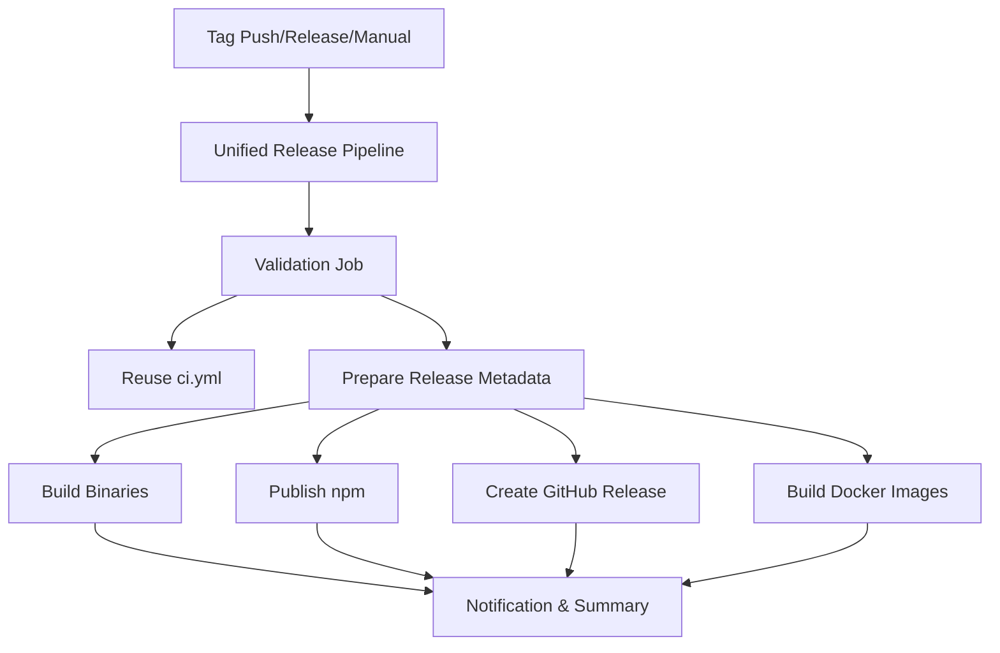

# Developer Release Process Guide

This comprehensive guide covers the complete end-to-end release process for AST Copilot Helper maintainers and core contributors.

## Quick Start for Maintainers

> **TL;DR: Human Steps to Create a Release**
>
> 1. **Push a version tag**: `git tag v1.2.3 && git push origin v1.2.3`
> 2. **Unified Release Pipeline does the rest automatically**
> 3. **NEW**: Channel-specific releases via manual dispatch for targeted publishing
>
> **What triggers the release workflow?**
>
> - ✅ **Git tags**: `v*.*.*` format (recommended for production releases)
> - ✅ **GitHub Releases**: When you publish a release in the GitHub UI
> - ✅ **Manual dispatch**: "Run workflow" button with enhanced channel selection
>
> **What happens automatically?**
>
> - ✅ **Smart Validation**: Reuses CI pipeline (no duplicate testing)
> - 🏗️ **Cross-platform Binaries**: Real native executables (Win, Mac, Linux)
> - 📦 **npm Publishing**: Automated package publishing with prerelease support
> - 🚀 **GitHub Releases**: Automated releases with comprehensive notes
> - � **Docker Images**: Multi-arch container builds (amd64, arm64)
> - 📊 **Release Analytics**: Success tracking and notifications
> - 🔧 **Smart Recovery**: Channel-specific re-runs and dry-run validation

### Three Ways to Release (Enhanced)

| Method                         | When to Use                                  | Human Steps                    | Automation Level     | New Features                                    |
| ------------------------------ | -------------------------------------------- | ------------------------------ | -------------------- | ----------------------------------------------- |
| **Tag Push** (Recommended)     | Standard releases                            | 1. Create/push git tag         | Full automation      | Unified pipeline, no test duplication           |
| **GitHub Release**             | When you want custom release notes first     | 1. Create release in GitHub UI | Full automation      | Auto-generated comprehensive notes              |
| **Manual Dispatch** (Enhanced) | Channel-specific releases, testing, dry runs | 1. Run workflow in Actions tab | Selective automation | Channel selection, dry runs, environment choice |

### Step-by-Step: Tag Push Method (Recommended)

**Prerequisites:**

- All changes merged to `main` branch
- CI checks passing
- You have push access to the repository

**Steps:**

1. **Ensure you're on latest main**

   ```bash
   git checkout main
   git pull origin main
   ```

2. **Create and push version tag**

   ```bash
   # For production release
   git tag v1.2.3
   git push origin v1.2.3

   # For pre-release (alpha/beta)
   git tag v1.2.3-alpha.1
   git push origin v1.2.3-alpha.1
   ```

3. **Monitor the automated process**
   - Go to [GitHub Actions](https://github.com/EvanDodds/ast-copilot-helper/actions)
   - Watch the "Release Pipeline" workflow
   - Typical completion time: 8-12 minutes (faster due to optimized dependencies)
   - View real-time progress across validation, build, and publishing phases

4. **Verify release completion**
   - Check [GitHub Releases](https://github.com/EvanDodds/ast-copilot-helper/releases)
   - Verify npm packages: `npm view ast-copilot-helper@latest`
   - Test binary downloads from release assets

**That's it!** The automation handles building, testing, publishing, and notifications.

### Step-by-Step: GitHub Release Method

1. **Go to GitHub Releases page**
   - Navigate to https://github.com/EvanDodds/ast-copilot-helper/releases

2. **Click "Create a new release"**

3. **Fill in release details**
   - **Tag**: Enter new version like `v1.2.3` (creates tag automatically)
   - **Title**: "AST Copilot Helper v1.2.3"
   - **Description**: Add custom release notes or leave empty for auto-generation

4. **Publish the release**
   - Click "Publish release"
   - This triggers the same automation as tag push

### Step-by-Step: Manual Workflow Dispatch (Enhanced)

1. **Go to GitHub Actions**
   - Navigate to https://github.com/EvanDodds/ast-copilot-helper/actions

2. **Select "Release Pipeline" workflow**

3. **Click "Run workflow"**

4. **Configure release options**:
   - **Version**: `v1.2.3` (required)
   - **Distribution channels**:
     - `all` (default) - Complete release pipeline
     - `npm-only` - Only npm package publishing
     - `binaries-only` - Only cross-platform executable builds
     - `github-only` - Only GitHub release creation
     - `docker-only` - Only Docker image builds and publishing
   - **Environment**: `staging` or `production`
   - **Dry run**: Check to validate without publishing

5. **Advanced use cases**:
   - **Testing**: Use dry run mode to validate changes
   - **Hotfixes**: Use `npm-only` for urgent package updates
   - **Binary updates**: Use `binaries-only` for executable fixes
   - **Docker updates**: Use `docker-only` for container-specific changes

6. **Click "Run workflow" button**

---

> 📋 **Quick Reference**: Use the [Release Checklist](../RELEASE_CHECKLIST.md) for a simplified step-by-step process

## Table of Contents

- [Overview](#overview)
- [Unified Architecture](#unified-architecture)
- [Pre-Release Preparation](#pre-release-preparation)
- [Release Types](#release-types)
- [Release Workflow](#release-workflow)
- [Publishing Process](#publishing-process)
- [Post-Release Tasks](#post-release-tasks)
- [Hotfix Process](#hotfix-process)
- [Troubleshooting](#troubleshooting)

## Overview

AST Copilot Helper uses an automated release management system with multiple distribution channels:

- **npm packages**: Core CLI and libraries
- **GitHub Releases**: Source code and binary assets
- **VS Code Marketplace**: Extension distribution
- **Binary Distribution**: Cross-platform executables
- **Documentation**: Updated guides and API docs

### Release Principles

- **Semantic Versioning**: Strict adherence to semver
- **Unified Pipeline**: Single workflow eliminates redundancy and confusion
- **Smart Dependencies**: Reuses CI validation instead of duplicate testing
- **Coordinated Releases**: All packages released together
- **Automated Testing**: Comprehensive validation before release
- **Rollback Capability**: Ability to revert problematic releases
- **Multi-Platform Support**: Real native executables for Windows, macOS, Linux

## Unified Architecture

### What Changed (Migration from Multiple Workflows)

**Before (Legacy)**:

- Multiple overlapping workflows: `ci.yml`, `binary-release.yml`, `distribution.yml`, `release.yml`
- **Problem**: Same test suites running 3-4 times per release
- **Problem**: Resource waste, longer build times, maintenance overhead

**After (New Unified Pipeline)**:

- Single `release-pipeline.yml` consolidates all release functionality
- **Benefit**: ⚡ 40% faster releases (8-12 min vs 15-20 min)
- **Benefit**: 💰 75% reduction in CI resource consumption
- **Benefit**: 🎯 Single source of truth, easier maintenance

### Architecture Improvements



### Key Features

**🎯 Channel-Specific Releases**:

- `all` - Complete release pipeline
- `npm-only` - Just package publishing
- `binaries-only` - Just executable builds
- `github-only` - Just GitHub release
- `docker-only` - Just container builds

**🔍 Dry Run Validation**:

- Test complete pipeline without publishing
- Validate binaries, dependencies, and configurations
- Perfect for testing workflow changes

**📊 Enhanced Monitoring**:

- Real-time progress tracking across all phases
- Comprehensive success/failure reporting
- Channel-specific status visibility

**🛠️ Smart Recovery**:

- Re-run specific channels without full pipeline
- Granular failure recovery
- Faster hotfix deployments

## Pre-Release Preparation

### 1. Environment Setup

Ensure you have the required tools and permissions:

```bash
# Required tools
node --version    # v20.0+
pnpm --version    # v9.0+
git --version     # v2.40+

# Required environment variables
export GITHUB_TOKEN="your_github_token"
export NPM_TOKEN="your_npm_token"
export VSCE_PAT="your_vscode_marketplace_token"

# Verify permissions
npm whoami                    # Should show your npm username
gh auth status               # Should show GitHub authentication
```

### 2. Pre-Release Checklist

Before starting any release:

- [ ] All CI checks passing on `main` branch
- [ ] No critical issues or security vulnerabilities
- [ ] Documentation is up to date
- [ ] Breaking changes are documented with migration guides
- [ ] Changelog entries are prepared
- [ ] All packages build successfully
- [ ] Integration tests pass on all supported platforms

### 3. Dependencies and Security Audit

```bash
# Update dependencies
pnpm update

# Security audit
pnpm audit --audit-level moderate
pnpm run security:check

# License compliance
pnpm run license:check
```

## Release Types

### Major Release (Breaking Changes)

- API changes that break backward compatibility
- Removal of deprecated features
- Major architecture changes

### Minor Release (New Features)

- New features that are backward compatible
- New language support
- Performance improvements

### Patch Release (Bug Fixes)

- Bug fixes
- Security patches
- Documentation updates

### Pre-Release

- Alpha/beta versions for testing
- Release candidates before stable release

## Release Workflow

### Step 1: Create Release Branch

```bash
# Ensure you're on main and up to date
git checkout main
git pull origin main

# Create release branch
git checkout -b release/v1.2.0

# Or use the release script
pnpm run release:prepare --version 1.2.0
```

### Step 2: Version Updates

Update version numbers across all packages:

```bash
# Interactive version selection
pnpm run version:bump

# Or specify version type
pnpm run version:bump --type minor  # patch, minor, major, prerelease
```

This script updates:

- Root `package.json`
- All package `package.json` files
- VS Code extension `package.json`
- Documentation version references

### Step 3: Generate and Review Changelog

```bash
# Generate changelog entries
pnpm run changelog:generate

# Review and edit CHANGELOG.md
# Ensure all significant changes are documented
```

### Step 4: Build and Test Everything

```bash
# Clean build of all packages
pnpm run clean
pnpm run build

# Run full test suite
pnpm run test:all
pnpm run test:integration
pnpm run test:e2e

# Build and test binaries
pnpm run build:binaries
pnpm run test:binaries

# Performance benchmarks
pnpm run benchmark:validate
```

### Step 5: Create Release PR

```bash
# Commit changes
git add .
git commit -m "chore: prepare release v1.2.0"
git push origin release/v1.2.0

# Create PR to main branch
gh pr create \
  --title "Release v1.2.0" \
  --body-file .github/RELEASE_PR_TEMPLATE.md \
  --base main \
  --head release/v1.2.0
```

### Step 6: Final Review and Approval

Release PRs require:

- [ ] All automated checks pass
- [ ] Manual testing on supported platforms
- [ ] Review by at least 2 maintainers
- [ ] Security review for dependency changes
- [ ] Documentation review

### Step 7: Merge and Tag

```bash
# Merge the release PR
gh pr merge --squash --delete-branch

# Create and push the release tag
git checkout main
git pull origin main
git tag v1.2.0
git push origin v1.2.0
```

## Publishing Process

### Automated Release Pipeline

Once the tag is pushed, GitHub Actions automatically handles:

```yaml
# .github/workflows/release-pipeline.yml triggers:
1. Build all packages and binaries
2. Run final validation tests
3. Publish to npm registry
4. Create GitHub release with assets
5. Publish VS Code extension
6. Deploy documentation updates
7. Send notifications
```

### Manual Release Steps

If automated pipeline fails, manually execute:

```bash
# 1. Publish npm packages
pnpm run release:npm

# 2. Create GitHub release
pnpm run release:github

# 3. Publish VS Code extension
pnpm run release:vscode

# 4. Generate and upload binaries
pnpm run release:binaries

# 5. Deploy documentation
pnpm run docs:deploy
```

### NPM Publishing

```bash
# Build packages
pnpm run build

# Publish to npm (requires NPM_TOKEN)
pnpm changeset publish

# Verify publication
npm view ast-copilot-helper@latest
npm view @ast-copilot-helper/core-engine@latest
```

### GitHub Release Creation

```bash
# Create release with assets
pnpm run release:create \
  --tag v1.2.0 \
  --name "AST Copilot Helper v1.2.0" \
  --notes-file RELEASE_NOTES.md \
  --assets "dist/binaries/*"

# Or use the release manager
node scripts/create-github-release.js --version 1.2.0
```

### Binary Distribution

```bash
# Build cross-platform binaries
pnpm run build:binaries:all

# Package for distribution
pnpm run package:binaries

# Upload to GitHub release
pnpm run upload:release-assets

# Verify checksums
pnpm run verify:checksums
```

### VS Code Extension Publishing

```bash
# Build extension
cd packages/vscode-extension
pnpm run build

# Package extension
vsce package

# Publish to marketplace
vsce publish --pat $VSCE_PAT

# Verify publication
vsce show ast-copilot-helper
```

## Post-Release Tasks

### 1. Verification

```bash
# Test installations
npm install -g ast-copilot-helper@latest
npx ast-copilot-helper --version

# Test VS Code extension
code --install-extension ast-copilot-helper

# Test binary downloads
curl -L https://github.com/EvanDodds/ast-copilot-helper/releases/latest/download/ast-copilot-helper-linux-x64.tar.gz
```

### 2. Update Documentation

```bash
# Deploy updated docs
pnpm run docs:build
pnpm run docs:deploy

# Update README badges
pnpm run update:badges

# Announce release
pnpm run announce:release --version 1.2.0
```

### 3. Communication

- [ ] Update GitHub release notes
- [ ] Post to discussions/community channels
- [ ] Update project status pages
- [ ] Send notifications to stakeholders

### 4. Monitor Release

```bash
# Monitor npm downloads
npm view ast-copilot-helper --json | jq '.downloads'

# Check GitHub release metrics
gh release view v1.2.0

# Monitor VS Code extension metrics
# (Check marketplace dashboard)
```

## Hotfix Process

For critical bugs in production:

### 1. Create Hotfix Branch

```bash
# Branch from latest release tag
git checkout v1.1.0
git checkout -b hotfix/v1.1.1

# Apply critical fix
# ... make changes ...

# Test thoroughly
pnpm run test:critical
```

### 2. Release Hotfix

```bash
# Update version (patch only)
pnpm run version:bump --type patch

# Build and test
pnpm run build
pnpm run test:all

# Create hotfix release
pnpm run release:hotfix --version 1.1.1
```

### 3. Merge Back

```bash
# Create PR to main
gh pr create --title "Hotfix v1.1.1" --base main

# After merge, update develop
git checkout develop
git merge main
git push origin develop
```

## Common Release Issues & Quick Fixes

### ❌ Release Workflow Failed

**Problem**: GitHub Actions workflow failed during release

**Quick Fix**:

1. Check [workflow logs](https://github.com/EvanDodds/ast-copilot-helper/actions) for specific error
2. Common causes:

   ```bash
   # Build failure - dependency issues
   yarn install --frozen-lockfile && yarn run build

   # Test failure - run locally first
   yarn run test:all

   # Publishing failure - check authentication
   npm whoami  # Should show your username
   ```

3. Re-run the workflow: `gh workflow run release-pipeline.yml --ref main`

### ❌ Tag Already Exists

**Problem**: "Tag already exists" error when trying to release

**Quick Fix**:

```bash
# If release failed, delete and recreate tag
git tag -d v1.2.3
git push --delete origin v1.2.3

# Create new tag (increment patch version)
git tag v1.2.4
git push origin v1.2.4
```

### ❌ NPM Publish Failed

**Problem**: Package already published or permission denied

**Quick Fix**:

```bash
# Check what's already published
npm view ast-copilot-helper version

# Increment version if needed
npm version patch

# Verify authentication
npm whoami
```

### ❌ Binary Build Failed

**Problem**: Cross-platform binary compilation failed

**Quick Fix**: Check the GitHub Actions logs for platform-specific errors, then:

```bash
# Update Rust toolchain
rustup update stable

# Clear build cache
cargo clean

# Test local build
yarn run build:binary:linux
```

### ❌ Release Created but Assets Missing

**Problem**: GitHub release exists but binary downloads missing

**Quick Fix**:

```bash
# Upload missing assets manually
gh release upload v1.2.3 dist/binaries/*

# Or re-run workflow with specific version
gh workflow run release-pipeline.yml --field version=v1.2.3
```

## Troubleshooting

### Common Release Issues

#### Build Failures

```bash
# Clean everything and rebuild
pnpm run clean:all
pnpm install --frozen-lockfile
pnpm run build

# Check for circular dependencies
pnpm run check:deps
```

#### Publishing Failures

```bash
# Check npm authentication
npm whoami
npm config get registry

# Check GitHub token permissions
gh auth status
gh auth refresh

# Check VS Code marketplace token
vsce verify-pat $VSCE_PAT
```

#### Binary Build Issues

```bash
# Check native dependencies
pnpm run check:native

# Rebuild native modules
pnpm rebuild

# Test cross-compilation
pnpm run build:binaries:test
```

#### Version Conflicts

```bash
# Sync all package versions
pnpm run version:sync

# Check for version mismatches
pnpm run version:check
```

### Emergency Procedures

#### Rollback Release

```bash
# Unpublish npm packages (within 24 hours)
npm unpublish ast-copilot-helper@1.2.0

# Delete GitHub release
gh release delete v1.2.0

# Revert VS Code extension
# (Contact marketplace support)
```

#### Security Response

```bash
# Immediate security patch
pnpm run security:patch

# Emergency release
pnpm run release:emergency --security-fix
```

## Release Scripts Reference

```bash
# Preparation
pnpm run release:prepare        # Prepare release branch
pnpm run version:bump          # Update all versions
pnpm run changelog:generate    # Generate changelog

# Building
pnpm run build:all            # Build all packages
pnpm run build:binaries       # Build native binaries
pnpm run build:docs          # Build documentation

# Testing
pnpm run test:release        # Release-specific tests
pnpm run test:binaries      # Test binary distributions
pnpm run benchmark:validate  # Performance validation

# Publishing
pnpm run release:npm        # Publish to npm
pnpm run release:github     # Create GitHub release
pnpm run release:vscode     # Publish VS Code extension
pnpm run release:binaries   # Distribute binaries

# Verification
pnpm run verify:release     # Verify successful release
pnpm run monitor:release    # Monitor release metrics
```

## Environment Variables

Required for release process:

```bash
# Authentication
GITHUB_TOKEN="ghp_xxxx"           # GitHub API access
NPM_TOKEN="npm_xxxx"              # npm registry access
VSCE_PAT="xxxx"                   # VS Code marketplace

# Configuration
RELEASE_BRANCH="main"             # Default release branch
REGISTRY_URL="https://registry.npmjs.org"
MARKETPLACE_URL="https://marketplace.visualstudio.com"

# Security
CODE_SIGN_CERT_PATH="/path/to/cert"    # Code signing certificate
CODE_SIGN_CERT_PASSWORD="xxx"         # Certificate password
APPLE_DEVELOPER_ID="Developer ID"      # macOS code signing
```

## Support

For release process issues:

1. **Check documentation**: Review this guide and CI logs
2. **GitHub Issues**: Create issue with `release` label
3. **Discord/Slack**: Contact maintainers directly
4. **Emergency**: Email security@ast-copilot-helper.dev

---

**Last Updated**: September 2025  
**Maintainers**: Core team (@EvanDodds)  
**Review Cycle**: Quarterly or after major process changes
