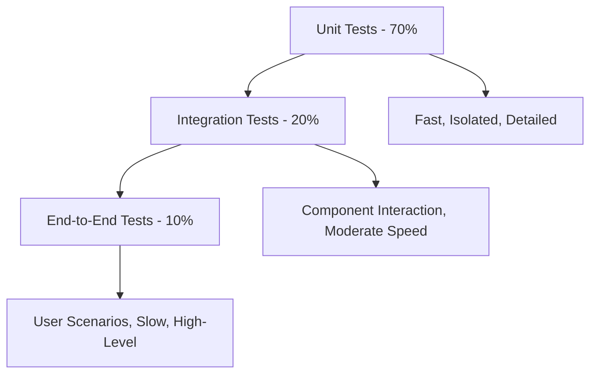

# Testing Guide

This comprehensive guide covers all aspects of testing ast-copilot-helper, from writing unit tests to running end-to-end scenarios. Follow these practices to ensure code quality and reliability.

## Testing Philosophy

### Principles

1. **Test-Driven Development**: Write tests before implementing features
2. **Comprehensive Coverage**: Aim for high test coverage without sacrificing quality
3. **Fast Feedback**: Tests should run quickly and provide clear failure messages
4. **Realistic Scenarios**: Tests should reflect real-world usage patterns
5. **Maintainable Tests**: Tests should be easy to understand and modify

### Testing Pyramid



## Test Structure

### Directory Organization

```
tests/
├── unit/                           # Unit tests
│   ├── parser/
│   │   ├── typescript.test.ts
│   │   ├── python.test.ts
│   │   └── javascript.test.ts
│   ├── query/
│   │   ├── engine.test.ts
│   │   └── embeddings.test.ts
│   ├── ai/
│   │   ├── openai-provider.test.ts
│   │   └── embedding-generator.test.ts
│   └── database/
│       ├── manager.test.ts
│       └── migrations.test.ts
├── integration/                    # Integration tests
│   ├── cli/
│   │   ├── parse-command.test.ts
│   │   ├── query-command.test.ts
│   │   └── server-command.test.ts
│   ├── mcp-server/
│   │   ├── protocol.test.ts
│   │   ├── tools.test.ts
│   │   └── resources.test.ts
│   └── vscode-extension/
│       ├── commands.test.ts
│       ├── providers.test.ts
│       └── webview.test.ts
├── e2e/                           # End-to-end tests
│   ├── workflows/
│   │   ├── new-project-setup.test.ts
│   │   ├── code-analysis-workflow.test.ts
│   │   └── ai-integration.test.ts
│   └── user-scenarios/
│       ├── typescript-project.test.ts
│       ├── python-project.test.ts
│       └── monorepo-project.test.ts
├── performance/                   # Performance tests
│   ├── parsing/
│   │   ├── large-files.bench.ts
│   │   └── parallel-processing.bench.ts
│   ├── querying/
│   │   ├── semantic-search.bench.ts
│   │   └── database-queries.bench.ts
│   └── embedding/
│       ├── generation-speed.bench.ts
│       └── batch-processing.bench.ts
├── fixtures/                      # Test data
│   ├── projects/
│   │   ├── typescript-sample/
│   │   ├── python-sample/
│   │   └── javascript-sample/
│   ├── expected-results/
│   │   ├── typescript-annotations.json
│   │   └── python-annotations.json
│   └── test-files/
│       ├── valid-syntax/
│       └── invalid-syntax/
└── utils/                        # Test utilities
    ├── test-helpers.ts
    ├── mock-factories.ts
    └── fixture-loader.ts
```

## Testing Tools and Frameworks

### Core Testing Stack

- **Jest**: Test runner and assertion library
- **Vitest**: Fast test runner (alternative to Jest)
- **@testing-library/node**: Testing utilities for Node.js
- **supertest**: HTTP assertion library
- **nock**: HTTP mocking library
- **tmp**: Temporary file/directory creation

### Configuration

**vitest.config.ts:**

```typescript
import { defineConfig } from "vitest/config";

export default defineConfig({
  test: {
    globals: true,
    environment: "node",
    setupFiles: ["./tests/setup.ts"],
    coverage: {
      provider: "v8",
      reporter: ["text", "html", "json"],
      exclude: [
        "node_modules/",
        "dist/",
        "**/*.d.ts",
        "**/*.test.ts",
        "**/__tests__/**",
      ],
      thresholds: {
        global: {
          statements: 90,
          branches: 85,
          functions: 90,
          lines: 90,
        },
      },
    },
    testTimeout: 30000,
    poolOptions: {
      threads: {
        singleThread: true, // For database tests
      },
    },
  },
});
```

**tests/setup.ts:**

```typescript
import { beforeAll, afterAll, beforeEach, afterEach } from "vitest";
import { tmpdir } from "os";
import { mkdtemp, rm } from "fs/promises";
import { join } from "path";

let tempDir: string;

beforeAll(async () => {
  // Global setup
  process.env.NODE_ENV = "test";
  process.env.LOG_LEVEL = "silent";
});

afterAll(async () => {
  // Global cleanup
});

beforeEach(async () => {
  // Create temp directory for each test
  tempDir = await mkdtemp(join(tmpdir(), "ast-helper-test-"));
});

afterEach(async () => {
  // Clean up temp directory
  if (tempDir) {
    await rm(tempDir, { recursive: true, force: true });
  }
});

// Make tempDir available globally
global.getTempDir = () => tempDir;
```

## Unit Testing

### Parser Tests

**tests/unit/parser/typescript.test.ts:**

```typescript
import { describe, it, expect, beforeEach } from "vitest";
import { TypeScriptParser } from "../../../packages/ast-helper/src/parser/typescript";
import { ASTAnnotation } from "../../../packages/ast-helper/src/types";

describe("TypeScriptParser", () => {
  let parser: TypeScriptParser;

  beforeEach(() => {
    parser = new TypeScriptParser({
      includePrivateMembers: false,
      extractComments: true,
      resolveTypes: true,
    });
  });

  describe("parseFunction", () => {
    it("should extract basic function information", async () => {
      const source = `
        /**
         * Calculates tax based on income
         * @param income - Annual income
         * @param rate - Tax rate (0-1)
         */
        function calculateTax(income: number, rate: number): number {
          return income * rate;
        }
      `;

      const result = await parser.parse(source);

      expect(result).toHaveLength(1);
      expect(result[0]).toMatchObject({
        type: "function",
        name: "calculateTax",
        description: "Calculates tax based on income",
        parameters: [
          { name: "income", type: "number" },
          { name: "rate", type: "number" },
        ],
        returnType: "number",
      });
    });

    it("should handle async functions", async () => {
      const source = `
        async function fetchUserData(id: string): Promise<User> {
          return await api.getUser(id);
        }
      `;

      const result = await parser.parse(source);

      expect(result[0]).toMatchObject({
        type: "function",
        name: "fetchUserData",
        isAsync: true,
        returnType: "Promise<User>",
      });
    });

    it("should extract arrow functions", async () => {
      const source = `
        const validateEmail = (email: string): boolean => {
          return /^[^@]+@[^@]+\\.[^@]+$/.test(email);
        };
      `;

      const result = await parser.parse(source);

      expect(result[0]).toMatchObject({
        type: "function",
        name: "validateEmail",
        isArrowFunction: true,
        parameters: [{ name: "email", type: "string" }],
        returnType: "boolean",
      });
    });
  });

  describe("parseClass", () => {
    it("should extract class with methods and properties", async () => {
      const source = `
        /**
         * User management class
         */
        class UserManager {
          private users: User[] = [];

          constructor(initialUsers: User[]) {
            this.users = initialUsers;
          }

          /**
           * Adds a new user
           */
          public addUser(user: User): void {
            this.users.push(user);
          }

          get userCount(): number {
            return this.users.length;
          }
        }
      `;

      const result = await parser.parse(source);

      const classAnnotation = result.find((a) => a.type === "class");
      expect(classAnnotation).toMatchObject({
        type: "class",
        name: "UserManager",
        description: "User management class",
      });

      const methods = result.filter((a) => a.type === "method");
      expect(methods).toHaveLength(3); // constructor, addUser, get userCount

      const addUserMethod = methods.find((m) => m.name === "addUser");
      expect(addUserMethod).toMatchObject({
        type: "method",
        name: "addUser",
        visibility: "public",
        parameters: [{ name: "user", type: "User" }],
        returnType: "void",
      });
    });
  });

  describe("parseInterface", () => {
    it("should extract interface definitions", async () => {
      const source = `
        /**
         * User interface definition
         */
        interface User {
          id: string;
          email: string;
          age?: number;
          preferences: UserPreferences;
        }
      `;

      const result = await parser.parse(source);

      expect(result[0]).toMatchObject({
        type: "interface",
        name: "User",
        description: "User interface definition",
        properties: [
          { name: "id", type: "string", required: true },
          { name: "email", type: "string", required: true },
          { name: "age", type: "number", required: false },
          { name: "preferences", type: "UserPreferences", required: true },
        ],
      });
    });
  });

  describe("error handling", () => {
    it("should handle syntax errors gracefully", async () => {
      const invalidSource = `
        function invalidSyntax() {
          return // missing value
        }
      `;

      await expect(parser.parse(invalidSource)).rejects.toThrow(/Syntax error/);
    });

    it("should continue parsing after recoverable errors", async () => {
      const sourceWithErrors = `
        function validFunction(): void {}
        
        function invalidFunction() {
          return // syntax error
        }
        
        function anotherValidFunction(): string {
          return "hello";
        }
      `;

      const result = await parser.parse(sourceWithErrors);

      // Should parse valid functions despite syntax errors
      expect(result).toHaveLength(2);
      expect(result.map((r) => r.name)).toEqual([
        "validFunction",
        "anotherValidFunction",
      ]);
    });
  });
});
```

### Query Engine Tests

**tests/unit/query/engine.test.ts:**

```typescript
import { describe, it, expect, beforeEach, vi } from "vitest";
import { QueryEngine } from "../../../packages/ast-helper/src/query/engine";
import { DatabaseManager } from "../../../packages/ast-helper/src/database/manager";
import { EmbeddingGenerator } from "../../../packages/ast-helper/src/ai/embedding-generator";
import { createMockAnnotations } from "../../utils/mock-factories";

// Mock dependencies
vi.mock("../../../packages/ast-helper/src/database/manager");
vi.mock("../../../packages/ast-helper/src/ai/embedding-generator");

describe("QueryEngine", () => {
  let queryEngine: QueryEngine;
  let mockDatabase: vi.Mocked<DatabaseManager>;
  let mockEmbeddingGenerator: vi.Mocked<EmbeddingGenerator>;

  beforeEach(() => {
    mockDatabase = vi.mocked(new DatabaseManager("test.db"));
    mockEmbeddingGenerator = vi.mocked(new EmbeddingGenerator());
    queryEngine = new QueryEngine(mockDatabase, mockEmbeddingGenerator);
  });

  describe("semantic search", () => {
    it("should perform vector similarity search", async () => {
      // Arrange
      const query = "authentication functions";
      const queryEmbedding = [0.1, 0.2, 0.3];
      const mockResults = createMockAnnotations([
        { name: "authenticateUser", type: "function", score: 0.89 },
        { name: "validateToken", type: "function", score: 0.85 },
      ]);

      mockEmbeddingGenerator.generate.mockResolvedValue([queryEmbedding]);
      mockDatabase.searchBySimilarity.mockResolvedValue(mockResults);

      // Act
      const results = await queryEngine.query(query, {
        similarityThreshold: 0.7,
        maxResults: 10,
      });

      // Assert
      expect(mockEmbeddingGenerator.generate).toHaveBeenCalledWith([query]);
      expect(mockDatabase.searchBySimilarity).toHaveBeenCalledWith(
        queryEmbedding,
        0.7,
        10,
      );
      expect(results).toHaveLength(2);
      expect(results[0].name).toBe("authenticateUser");
    });

    it("should handle empty results", async () => {
      // Arrange
      mockEmbeddingGenerator.generate.mockResolvedValue([[0.1, 0.2, 0.3]]);
      mockDatabase.searchBySimilarity.mockResolvedValue([]);

      // Act
      const results = await queryEngine.query("nonexistent function");

      // Assert
      expect(results).toHaveLength(0);
    });
  });

  describe("text search", () => {
    it("should perform full-text search when embeddings disabled", async () => {
      // Arrange
      const query = "user management";
      const mockResults = createMockAnnotations([
        { name: "createUser", type: "function" },
        { name: "UserManager", type: "class" },
      ]);

      mockDatabase.searchByText.mockResolvedValue(mockResults);

      // Act
      const results = await queryEngine.query(query, {
        useSemanticSearch: false,
      });

      // Assert
      expect(mockDatabase.searchByText).toHaveBeenCalledWith(query, {});
      expect(mockEmbeddingGenerator.generate).not.toHaveBeenCalled();
      expect(results).toHaveLength(2);
    });
  });

  describe("filtering", () => {
    it("should filter results by type", async () => {
      // Arrange
      const mockResults = createMockAnnotations([
        { name: "User", type: "interface" },
        { name: "createUser", type: "function" },
        { name: "UserManager", type: "class" },
      ]);

      mockEmbeddingGenerator.generate.mockResolvedValue([[0.1, 0.2, 0.3]]);
      mockDatabase.searchBySimilarity.mockResolvedValue(mockResults);

      // Act
      const results = await queryEngine.query("user", { type: "function" });

      // Assert
      expect(results).toHaveLength(1);
      expect(results[0].type).toBe("function");
    });

    it("should filter results by file pattern", async () => {
      // Arrange
      const mockResults = createMockAnnotations([
        {
          name: "authFunction",
          type: "function",
          filePath: "src/auth/login.ts",
        },
        {
          name: "userFunction",
          type: "function",
          filePath: "src/user/manager.ts",
        },
      ]);

      mockEmbeddingGenerator.generate.mockResolvedValue([[0.1, 0.2, 0.3]]);
      mockDatabase.searchBySimilarity.mockResolvedValue(mockResults);

      // Act
      const results = await queryEngine.query("function", {
        filePattern: "src/auth/**",
      });

      // Assert
      expect(results).toHaveLength(1);
      expect(results[0].filePath).toMatch(/src\/auth\//);
    });
  });

  describe("error handling", () => {
    it("should handle embedding generation errors", async () => {
      // Arrange
      mockEmbeddingGenerator.generate.mockRejectedValue(
        new Error("API rate limit exceeded"),
      );
      mockDatabase.searchByText.mockResolvedValue([]);

      // Act & Assert
      await expect(queryEngine.query("test query")).rejects.toThrow(
        "API rate limit exceeded",
      );
    });

    it("should fall back to text search on embedding errors", async () => {
      // Arrange
      mockEmbeddingGenerator.generate.mockRejectedValue(
        new Error("Network error"),
      );
      mockDatabase.searchByText.mockResolvedValue([]);

      // Act
      const results = await queryEngine.query("test query", {
        fallbackToTextSearch: true,
      });

      // Assert
      expect(mockDatabase.searchByText).toHaveBeenCalled();
      expect(results).toHaveLength(0);
    });
  });
});
```

### Database Tests

**tests/unit/database/manager.test.ts:**

```typescript
import { describe, it, expect, beforeEach, afterEach } from "vitest";
import { DatabaseManager } from "../../../packages/ast-helper/src/database/manager";
import { ASTAnnotation } from "../../../packages/ast-helper/src/types";
import { join } from "path";
import { rm } from "fs/promises";

describe("DatabaseManager", () => {
  let dbManager: DatabaseManager;
  let dbPath: string;

  beforeEach(async () => {
    dbPath = join(getTempDir(), "test.db");
    dbManager = new DatabaseManager(dbPath);
    await dbManager.initialize();
  });

  afterEach(async () => {
    await dbManager.close();
    await rm(dbPath, { force: true });
  });

  describe("annotation operations", () => {
    it("should insert and retrieve annotations", async () => {
      // Arrange
      const annotation: ASTAnnotation = {
        id: "func_test_1",
        name: "testFunction",
        type: "function",
        filePath: "test.ts",
        lineNumber: 10,
        description: "Test function",
        parameters: [{ name: "param1", type: "string" }],
        returnType: "void",
      };

      // Act
      await dbManager.insertAnnotation(annotation);
      const retrieved = await dbManager.getAnnotation("func_test_1");

      // Assert
      expect(retrieved).toMatchObject(annotation);
    });

    it("should update existing annotations", async () => {
      // Arrange
      const annotation: ASTAnnotation = {
        id: "func_test_2",
        name: "testFunction",
        type: "function",
        filePath: "test.ts",
        lineNumber: 10,
      };

      await dbManager.insertAnnotation(annotation);

      // Act
      await dbManager.updateAnnotation("func_test_2", {
        description: "Updated description",
      });

      const updated = await dbManager.getAnnotation("func_test_2");

      // Assert
      expect(updated?.description).toBe("Updated description");
    });

    it("should delete annotations", async () => {
      // Arrange
      const annotation: ASTAnnotation = {
        id: "func_test_3",
        name: "testFunction",
        type: "function",
        filePath: "test.ts",
        lineNumber: 10,
      };

      await dbManager.insertAnnotation(annotation);

      // Act
      await dbManager.deleteAnnotation("func_test_3");
      const deleted = await dbManager.getAnnotation("func_test_3");

      // Assert
      expect(deleted).toBeNull();
    });
  });

  describe("search operations", () => {
    beforeEach(async () => {
      const annotations: ASTAnnotation[] = [
        {
          id: "func_auth_1",
          name: "authenticateUser",
          type: "function",
          filePath: "auth.ts",
          description: "Authenticates user with credentials",
        },
        {
          id: "func_auth_2",
          name: "validateToken",
          type: "function",
          filePath: "auth.ts",
          description: "Validates authentication token",
        },
        {
          id: "class_user_1",
          name: "UserManager",
          type: "class",
          filePath: "user.ts",
          description: "Manages user operations",
        },
      ];

      for (const annotation of annotations) {
        await dbManager.insertAnnotation(annotation);
      }
    });

    it("should search by text", async () => {
      // Act
      const results = await dbManager.searchByText("authentication");

      // Assert
      expect(results).toHaveLength(2);
      expect(results.map((r) => r.name)).toEqual([
        "authenticateUser",
        "validateToken",
      ]);
    });

    it("should filter by type", async () => {
      // Act
      const results = await dbManager.searchByText("user", { type: "class" });

      // Assert
      expect(results).toHaveLength(1);
      expect(results[0].type).toBe("class");
    });

    it("should filter by file pattern", async () => {
      // Act
      const results = await dbManager.searchByText("", {
        filePattern: "auth.ts",
      });

      // Assert
      expect(results).toHaveLength(2);
      expect(results.every((r) => r.filePath === "auth.ts")).toBe(true);
    });
  });

  describe("batch operations", () => {
    it("should handle large batch inserts", async () => {
      // Arrange
      const annotations: ASTAnnotation[] = [];
      for (let i = 0; i < 1000; i++) {
        annotations.push({
          id: `func_${i}`,
          name: `function${i}`,
          type: "function",
          filePath: `file${i}.ts`,
          lineNumber: i,
        });
      }

      // Act
      const startTime = Date.now();
      await dbManager.insertBatch(annotations);
      const endTime = Date.now();

      // Assert
      const count = await dbManager.countAnnotations();
      expect(count).toBe(1000);
      expect(endTime - startTime).toBeLessThan(5000); // Should complete in <5s
    });
  });
});
```

## Integration Testing

### CLI Integration Tests

**tests/integration/cli/parse-command.test.ts:**

```typescript
import { describe, it, expect, beforeEach, afterEach } from "vitest";
import { execSync } from "child_process";
import { writeFile, mkdir, rm } from "fs/promises";
import { join } from "path";
import { readFileSync, existsSync } from "fs";

describe("CLI Parse Command Integration", () => {
  let testProjectDir: string;
  let cliPath: string;

  beforeEach(async () => {
    testProjectDir = join(getTempDir(), "test-project");
    await mkdir(testProjectDir, { recursive: true });

    // Build CLI if not already built
    cliPath = join(__dirname, "../../../packages/ast-helper/bin/ast-helper.js");
  });

  afterEach(async () => {
    await rm(testProjectDir, { recursive: true, force: true });
  });

  it("should initialize project configuration", async () => {
    // Act
    const output = execSync(`node ${cliPath} init --yes`, {
      cwd: testProjectDir,
      encoding: "utf8",
    });

    // Assert
    expect(output).toContain("Initialized ast-copilot-helper");
    expect(existsSync(join(testProjectDir, ".ast-helper.json"))).toBe(true);

    const config = JSON.parse(
      readFileSync(join(testProjectDir, ".ast-helper.json"), "utf8"),
    );
    expect(config).toHaveProperty("parser");
    expect(config).toHaveProperty("ai");
  });

  it("should parse TypeScript files", async () => {
    // Arrange
    await writeFile(
      join(testProjectDir, "sample.ts"),
      `
        /**
         * Sample authentication function
         */
        export async function authenticateUser(
          username: string,
          password: string
        ): Promise<AuthResult> {
          // Implementation here
          return { success: true, user: null };
        }

        interface AuthResult {
          success: boolean;
          user: User | null;
        }
      `,
    );

    // Initialize project
    execSync(`node ${cliPath} init --yes`, {
      cwd: testProjectDir,
    });

    // Act
    const output = execSync(`node ${cliPath} parse sample.ts`, {
      cwd: testProjectDir,
      encoding: "utf8",
    });

    // Assert
    expect(output).toContain("Successfully parsed");
    expect(output).toContain("2 annotations"); // function + interface
    expect(existsSync(join(testProjectDir, ".ast-helper.db"))).toBe(true);

    // Verify database contents
    const queryOutput = execSync(`node ${cliPath} query "auth" --format json`, {
      cwd: testProjectDir,
      encoding: "utf8",
    });

    const results = JSON.parse(queryOutput);
    expect(results).toHaveLength(1);
    expect(results[0].name).toBe("authenticateUser");
  });

  it("should handle parsing errors gracefully", async () => {
    // Arrange
    await writeFile(
      join(testProjectDir, "invalid.ts"),
      `
        function invalidSyntax() {
          return // missing value
        }
      `,
    );

    execSync(`node ${cliPath} init --yes`, {
      cwd: testProjectDir,
    });

    // Act & Assert
    expect(() => {
      execSync(`node ${cliPath} parse invalid.ts`, {
        cwd: testProjectDir,
        encoding: "utf8",
      });
    }).toThrow();
  });

  it("should support batch parsing", async () => {
    // Arrange
    const files = ["file1.ts", "file2.ts", "file3.ts"];

    for (const file of files) {
      await writeFile(
        join(testProjectDir, file),
        `
          export function ${file.replace(".ts", "")}Function(): void {
            console.log('${file}');
          }
        `,
      );
    }

    execSync(`node ${cliPath} init --yes`, {
      cwd: testProjectDir,
    });

    // Act
    const output = execSync(`node ${cliPath} parse *.ts`, {
      cwd: testProjectDir,
      encoding: "utf8",
    });

    // Assert
    expect(output).toContain("Successfully parsed 3 files");
    expect(output).toContain("3 annotations");
  });
});
```

### MCP Server Integration Tests

**tests/integration/mcp-server/protocol.test.ts:**

```typescript
import { describe, it, expect, beforeEach, afterEach } from "vitest";
import { spawn, ChildProcess } from "child_process";
import { join } from "path";
import { writeFile, mkdir, rm } from "fs/promises";

describe("MCP Server Protocol Integration", () => {
  let serverProcess: ChildProcess;
  let testProjectDir: string;

  beforeEach(async () => {
    testProjectDir = join(getTempDir(), "mcp-test-project");
    await mkdir(testProjectDir, { recursive: true });

    // Set up test project with sample code
    await setupTestProject(testProjectDir);
  });

  afterEach(async () => {
    if (serverProcess) {
      serverProcess.kill();
    }
    await rm(testProjectDir, { recursive: true, force: true });
  });

  it("should handle MCP initialize request", async () => {
    // Arrange
    const serverPath = join(
      __dirname,
      "../../../packages/ast-mcp-server/bin/mcp-server.js",
    );
    serverProcess = spawn("node", [serverPath, "--transport", "stdio"], {
      cwd: testProjectDir,
    });

    const initRequest = {
      jsonrpc: "2.0",
      id: 1,
      method: "initialize",
      params: {
        protocolVersion: "2024-11-05",
        capabilities: {},
        clientInfo: { name: "test-client", version: "1.0.0" },
      },
    };

    // Act
    const response = await sendMCPRequest(serverProcess, initRequest);

    // Assert
    expect(response.id).toBe(1);
    expect(response.result).toHaveProperty("capabilities");
    expect(response.result.capabilities).toHaveProperty("resources");
    expect(response.result.capabilities).toHaveProperty("tools");
  });

  it("should list available tools", async () => {
    // Arrange
    serverProcess = startMCPServer(testProjectDir);
    await initializeMCPServer(serverProcess);

    const listToolsRequest = {
      jsonrpc: "2.0",
      id: 2,
      method: "tools/list",
      params: {},
    };

    // Act
    const response = await sendMCPRequest(serverProcess, listToolsRequest);

    // Assert
    expect(response.result.tools).toBeInstanceOf(Array);
    expect(response.result.tools.length).toBeGreaterThan(0);

    const toolNames = response.result.tools.map((t) => t.name);
    expect(toolNames).toContain("query_codebase");
    expect(toolNames).toContain("get_file_content");
    expect(toolNames).toContain("get_function_details");
  });

  it("should execute query_codebase tool", async () => {
    // Arrange
    serverProcess = startMCPServer(testProjectDir);
    await initializeMCPServer(serverProcess);

    const queryRequest = {
      jsonrpc: "2.0",
      id: 3,
      method: "tools/call",
      params: {
        name: "query_codebase",
        arguments: {
          query: "authentication functions",
          limit: 5,
        },
      },
    };

    // Act
    const response = await sendMCPRequest(serverProcess, queryRequest);

    // Assert
    expect(response.result.content).toBeInstanceOf(Array);
    expect(response.result.content[0].type).toBe("text");
    expect(response.result.content[0].text).toContain("authenticateUser");
  });

  it("should handle concurrent requests", async () => {
    // Arrange
    serverProcess = startMCPServer(testProjectDir);
    await initializeMCPServer(serverProcess);

    const requests = [
      {
        jsonrpc: "2.0",
        id: 4,
        method: "tools/call",
        params: {
          name: "query_codebase",
          arguments: { query: "function", limit: 3 },
        },
      },
      {
        jsonrpc: "2.0",
        id: 5,
        method: "tools/call",
        params: {
          name: "query_codebase",
          arguments: { query: "class", limit: 3 },
        },
      },
    ];

    // Act
    const responses = await Promise.all(
      requests.map((req) => sendMCPRequest(serverProcess, req)),
    );

    // Assert
    expect(responses).toHaveLength(2);
    expect(responses[0].id).toBe(4);
    expect(responses[1].id).toBe(5);
    responses.forEach((response) => {
      expect(response.result).toHaveProperty("content");
    });
  });

  async function setupTestProject(projectDir: string) {
    // Create sample TypeScript files
    await writeFile(
      join(projectDir, "auth.ts"),
      `
        export async function authenticateUser(username: string, password: string): Promise<boolean> {
          return username === 'admin' && password === 'secret';
        }

        export function validateToken(token: string): boolean {
          return token.length > 10;
        }
      `,
    );

    await writeFile(
      join(projectDir, "user.ts"),
      `
        export class UserManager {
          private users: User[] = [];

          addUser(user: User): void {
            this.users.push(user);
          }

          findUser(id: string): User | null {
            return this.users.find(u => u.id === id) || null;
          }
        }

        interface User {
          id: string;
          name: string;
          email: string;
        }
      `,
    );

    // Initialize and parse project
    const { execSync } = require("child_process");
    const cliPath = join(
      __dirname,
      "../../../packages/ast-helper/bin/ast-helper.js",
    );

    execSync(`node ${cliPath} init --yes`, { cwd: projectDir });
    execSync(`node ${cliPath} parse *.ts`, { cwd: projectDir });
  }

  function startMCPServer(projectDir: string): ChildProcess {
    const serverPath = join(
      __dirname,
      "../../../packages/ast-mcp-server/bin/mcp-server.js",
    );
    return spawn("node", [serverPath, "--transport", "stdio"], {
      cwd: projectDir,
      stdio: ["pipe", "pipe", "pipe"],
    });
  }

  async function initializeMCPServer(process: ChildProcess): Promise<void> {
    const initRequest = {
      jsonrpc: "2.0",
      id: 0,
      method: "initialize",
      params: {
        protocolVersion: "2024-11-05",
        capabilities: {},
        clientInfo: { name: "test-client", version: "1.0.0" },
      },
    };

    await sendMCPRequest(process, initRequest);
  }

  function sendMCPRequest(process: ChildProcess, request: any): Promise<any> {
    return new Promise((resolve, reject) => {
      const timeout = setTimeout(() => {
        reject(new Error("MCP request timeout"));
      }, 10000);

      process.stdout?.once("data", (data) => {
        clearTimeout(timeout);
        try {
          const response = JSON.parse(data.toString());
          resolve(response);
        } catch (error) {
          reject(error);
        }
      });

      process.stdin?.write(JSON.stringify(request) + "\n");
    });
  }
});
```

## End-to-End Testing

### User Workflow Tests

**tests/e2e/workflows/new-project-setup.test.ts:**

```typescript
import { describe, it, expect, beforeEach, afterEach } from "vitest";
import { execSync } from "child_process";
import { writeFile, mkdir, rm } from "fs/promises";
import { join } from "path";
import { existsSync, readFileSync } from "fs";

describe("New Project Setup E2E Workflow", () => {
  let projectDir: string;
  let cliPath: string;

  beforeEach(async () => {
    projectDir = join(getTempDir(), "e2e-project");
    await mkdir(projectDir, { recursive: true });
    cliPath = join(__dirname, "../../../packages/ast-helper/bin/ast-helper.js");
  });

  afterEach(async () => {
    await rm(projectDir, { recursive: true, force: true });
  });

  it("should complete full project setup and analysis workflow", async () => {
    // Step 1: Create a realistic project structure
    await createSampleProject(projectDir);

    // Step 2: Initialize ast-copilot-helper
    const initOutput = execSync(`node ${cliPath} init --yes`, {
      cwd: projectDir,
      encoding: "utf8",
    });

    expect(initOutput).toContain("Initialized ast-copilot-helper");
    expect(existsSync(join(projectDir, ".ast-helper.json"))).toBe(true);

    // Step 3: Parse the entire project
    const parseOutput = execSync(`node ${cliPath} parse src/`, {
      cwd: projectDir,
      encoding: "utf8",
    });

    expect(parseOutput).toContain("Successfully parsed");
    expect(parseOutput).toMatch(/\d+ annotations/);
    expect(existsSync(join(projectDir, ".ast-helper.db"))).toBe(true);

    // Step 4: Perform various queries
    const authQuery = execSync(
      `node ${cliPath} query "authentication functions" --format json`,
      {
        cwd: projectDir,
        encoding: "utf8",
      },
    );

    const authResults = JSON.parse(authQuery);
    expect(authResults.length).toBeGreaterThan(0);
    expect(authResults[0].name).toMatch(/auth|login|validate/i);

    // Step 5: Query by type
    const classQuery = execSync(
      `node ${cliPath} query "*" --type class --format json`,
      {
        cwd: projectDir,
        encoding: "utf8",
      },
    );

    const classResults = JSON.parse(classQuery);
    expect(classResults.every((r) => r.type === "class")).toBe(true);

    // Step 6: Generate analysis report
    const analysisOutput = execSync(`node ${cliPath} analyze --format json`, {
      cwd: projectDir,
      encoding: "utf8",
    });

    const analysis = JSON.parse(analysisOutput);
    expect(analysis).toHaveProperty("summary");
    expect(analysis.summary.totalFiles).toBeGreaterThan(0);
    expect(analysis.summary.totalAnnotations).toBeGreaterThan(0);

    // Step 7: Start and test MCP server (basic connectivity)
    const serverProcess = spawn(
      "node",
      [cliPath, "server", "--transport", "stdio"],
      {
        cwd: projectDir,
        stdio: ["pipe", "pipe", "pipe"],
      },
    );

    try {
      // Send basic initialize request
      const initRequest = {
        jsonrpc: "2.0",
        id: 1,
        method: "initialize",
        params: {
          protocolVersion: "2024-11-05",
          capabilities: {},
          clientInfo: { name: "e2e-test", version: "1.0.0" },
        },
      };

      serverProcess.stdin?.write(JSON.stringify(initRequest) + "\n");

      const response = await new Promise((resolve, reject) => {
        const timeout = setTimeout(
          () => reject(new Error("Server timeout")),
          5000,
        );

        serverProcess.stdout?.once("data", (data) => {
          clearTimeout(timeout);
          resolve(JSON.parse(data.toString()));
        });
      });

      expect(response).toHaveProperty("result");
      expect(response.result).toHaveProperty("capabilities");
    } finally {
      serverProcess.kill();
    }
  });

  async function createSampleProject(projectDir: string) {
    const srcDir = join(projectDir, "src");
    await mkdir(srcDir, { recursive: true });
    await mkdir(join(srcDir, "auth"), { recursive: true });
    await mkdir(join(srcDir, "user"), { recursive: true });
    await mkdir(join(srcDir, "utils"), { recursive: true });

    // Package.json
    await writeFile(
      join(projectDir, "package.json"),
      JSON.stringify(
        {
          name: "sample-project",
          version: "1.0.0",
          dependencies: {
            express: "^4.18.0",
            jsonwebtoken: "^9.0.0",
          },
          devDependencies: {
            typescript: "^5.0.0",
            "@types/node": "^18.0.0",
          },
        },
        null,
        2,
      ),
    );

    // TypeScript config
    await writeFile(
      join(projectDir, "tsconfig.json"),
      JSON.stringify(
        {
          compilerOptions: {
            target: "es2020",
            module: "commonjs",
            outDir: "dist",
            rootDir: "src",
            strict: true,
            esModuleInterop: true,
          },
          include: ["src/**/*"],
          exclude: ["node_modules", "dist"],
        },
        null,
        2,
      ),
    );

    // Auth module
    await writeFile(
      join(srcDir, "auth/auth.ts"),
      `
        import jwt from 'jsonwebtoken';
        import { User } from '../user/types';

        /**
         * Authenticates a user with username and password
         */
        export async function authenticateUser(
          username: string,
          password: string
        ): Promise<AuthResult> {
          // Validate credentials (simplified)
          if (username === 'admin' && password === 'secret') {
            const token = generateToken({ id: '1', username });
            return { success: true, token, user: { id: '1', username, email: 'admin@example.com' } };
          }
          
          return { success: false, error: 'Invalid credentials' };
        }

        /**
         * Validates a JWT token
         */
        export function validateToken(token: string): TokenValidation {
          try {
            const decoded = jwt.verify(token, process.env.JWT_SECRET || 'secret') as any;
            return { valid: true, payload: decoded };
          } catch (error) {
            return { valid: false, error: error.message };
          }
        }

        /**
         * Generates a JWT token for user
         */
        function generateToken(payload: TokenPayload): string {
          return jwt.sign(payload, process.env.JWT_SECRET || 'secret', { expiresIn: '1h' });
        }

        interface AuthResult {
          success: boolean;
          token?: string;
          user?: User;
          error?: string;
        }

        interface TokenValidation {
          valid: boolean;
          payload?: TokenPayload;
          error?: string;
        }

        interface TokenPayload {
          id: string;
          username: string;
        }
      `,
    );

    // User module
    await writeFile(
      join(srcDir, "user/manager.ts"),
      `
        import { User, CreateUserRequest } from './types';
        import { validateEmail } from '../utils/validation';

        /**
         * Manages user operations and data
         */
        export class UserManager {
          private users: Map<string, User> = new Map();

          /**
           * Creates a new user account
           */
          async createUser(request: CreateUserRequest): Promise<User> {
            if (!validateEmail(request.email)) {
              throw new Error('Invalid email format');
            }

            if (this.findUserByEmail(request.email)) {
              throw new Error('User already exists');
            }

            const user: User = {
              id: this.generateId(),
              username: request.username,
              email: request.email,
              createdAt: new Date(),
              isActive: true
            };

            this.users.set(user.id, user);
            return user;
          }

          /**
           * Finds user by ID
           */
          findUser(id: string): User | null {
            return this.users.get(id) || null;
          }

          /**
           * Finds user by email address
           */
          findUserByEmail(email: string): User | null {
            for (const user of this.users.values()) {
              if (user.email === email) {
                return user;
              }
            }
            return null;
          }

          /**
           * Updates user information
           */
          async updateUser(id: string, updates: Partial<User>): Promise<User | null> {
            const user = this.users.get(id);
            if (!user) return null;

            const updatedUser = { ...user, ...updates };
            this.users.set(id, updatedUser);
            return updatedUser;
          }

          /**
           * Deactivates user account
           */
          async deactivateUser(id: string): Promise<boolean> {
            const user = this.users.get(id);
            if (!user) return false;

            user.isActive = false;
            return true;
          }

          private generateId(): string {
            return Math.random().toString(36).substring(2) + Date.now().toString(36);
          }
        }
      `,
    );

    // User types
    await writeFile(
      join(srcDir, "user/types.ts"),
      `
        /**
         * User entity definition
         */
        export interface User {
          id: string;
          username: string;
          email: string;
          createdAt: Date;
          isActive: boolean;
          profile?: UserProfile;
        }

        /**
         * User profile information
         */
        export interface UserProfile {
          firstName?: string;
          lastName?: string;
          avatar?: string;
          bio?: string;
        }

        /**
         * Request to create new user
         */
        export interface CreateUserRequest {
          username: string;
          email: string;
          password: string;
        }

        /**
         * Request to update user
         */
        export interface UpdateUserRequest {
          username?: string;
          email?: string;
          profile?: Partial<UserProfile>;
        }
      `,
    );

    // Utils
    await writeFile(
      join(srcDir, "utils/validation.ts"),
      `
        /**
         * Validates email address format
         */
        export function validateEmail(email: string): boolean {
          const emailRegex = /^[^\\s@]+@[^\\s@]+\\.[^\\s@]+$/;
          return emailRegex.test(email);
        }

        /**
         * Validates password strength
         */
        export function validatePassword(password: string): PasswordValidation {
          const result: PasswordValidation = {
            valid: true,
            errors: []
          };

          if (password.length < 8) {
            result.valid = false;
            result.errors.push('Password must be at least 8 characters long');
          }

          if (!/[A-Z]/.test(password)) {
            result.valid = false;
            result.errors.push('Password must contain at least one uppercase letter');
          }

          if (!/[a-z]/.test(password)) {
            result.valid = false;
            result.errors.push('Password must contain at least one lowercase letter');
          }

          if (!/\\d/.test(password)) {
            result.valid = false;
            result.errors.push('Password must contain at least one number');
          }

          return result;
        }

        interface PasswordValidation {
          valid: boolean;
          errors: string[];
        }
      `,
    );

    // Main application file
    await writeFile(
      join(srcDir, "index.ts"),
      `
        import express from 'express';
        import { authenticateUser, validateToken } from './auth/auth';
        import { UserManager } from './user/manager';

        /**
         * Main application setup and configuration
         */
        class App {
          private app: express.Application;
          private userManager: UserManager;

          constructor() {
            this.app = express();
            this.userManager = new UserManager();
            this.setupMiddleware();
            this.setupRoutes();
          }

          private setupMiddleware(): void {
            this.app.use(express.json());
            this.app.use(this.authMiddleware.bind(this));
          }

          private setupRoutes(): void {
            this.app.post('/auth/login', this.handleLogin.bind(this));
            this.app.post('/users', this.handleCreateUser.bind(this));
            this.app.get('/users/:id', this.handleGetUser.bind(this));
          }

          private async authMiddleware(req: express.Request, res: express.Response, next: express.NextFunction): Promise<void> {
            if (req.path === '/auth/login') {
              next();
              return;
            }

            const token = req.headers.authorization?.replace('Bearer ', '');
            if (!token) {
              res.status(401).json({ error: 'No token provided' });
              return;
            }

            const validation = validateToken(token);
            if (!validation.valid) {
              res.status(401).json({ error: 'Invalid token' });
              return;
            }

            next();
          }

          private async handleLogin(req: express.Request, res: express.Response): Promise<void> {
            const { username, password } = req.body;
            const result = await authenticateUser(username, password);
            
            if (result.success) {
              res.json(result);
            } else {
              res.status(401).json({ error: result.error });
            }
          }

          private async handleCreateUser(req: express.Request, res: express.Response): Promise<void> {
            try {
              const user = await this.userManager.createUser(req.body);
              res.status(201).json(user);
            } catch (error) {
              res.status(400).json({ error: error.message });
            }
          }

          private async handleGetUser(req: express.Request, res: express.Response): Promise<void> {
            const user = this.userManager.findUser(req.params.id);
            if (user) {
              res.json(user);
            } else {
              res.status(404).json({ error: 'User not found' });
            }
          }

          start(port: number = 3000): void {
            this.app.listen(port, () => {
              console.log(\`Server running on port \${port}\`);
            });
          }
        }

        const app = new App();
        app.start();
      `,
    );
  }
});
```

## Performance Testing

### Benchmarks

**tests/performance/parsing/large-files.bench.ts:**

```typescript
import { describe, bench } from "vitest";
import { TypeScriptParser } from "../../../packages/ast-helper/src/parser/typescript";
import { generateLargeTypeScriptFile } from "../../utils/test-helpers";

describe("Large File Parsing Benchmarks", () => {
  const parser = new TypeScriptParser();

  bench(
    "parse 1000 function file",
    async () => {
      const source = generateLargeTypeScriptFile(1000);
      await parser.parse(source);
    },
    { iterations: 5 },
  );

  bench(
    "parse 5000 function file",
    async () => {
      const source = generateLargeTypeScriptFile(5000);
      await parser.parse(source);
    },
    { iterations: 3 },
  );

  bench(
    "parse 10000 function file",
    async () => {
      const source = generateLargeTypeScriptFile(10000);
      await parser.parse(source);
    },
    { iterations: 1 },
  );
});

describe("Memory Usage Tests", () => {
  bench("memory usage for large file parsing", async () => {
    const parser = new TypeScriptParser();
    const initialMemory = process.memoryUsage().heapUsed;

    const source = generateLargeTypeScriptFile(5000);
    await parser.parse(source);

    const finalMemory = process.memoryUsage().heapUsed;
    const memoryIncrease = finalMemory - initialMemory;

    // Should not use more than 500MB for 5000 functions
    expect(memoryIncrease).toBeLessThan(500 * 1024 * 1024);
  });
});
```

## Test Utilities

### Mock Factories

**tests/utils/mock-factories.ts:**

```typescript
import {
  ASTAnnotation,
  QueryResult,
} from "../../packages/ast-helper/src/types";

export function createMockAnnotation(
  overrides: Partial<ASTAnnotation> = {},
): ASTAnnotation {
  return {
    id: "mock_id_" + Math.random().toString(36).substring(2),
    name: "mockFunction",
    type: "function",
    filePath: "mock.ts",
    lineNumber: 1,
    description: "Mock function description",
    parameters: [],
    returnType: "void",
    ...overrides,
  };
}

export function createMockAnnotations(
  configs: Array<Partial<ASTAnnotation>>,
): ASTAnnotation[] {
  return configs.map((config) => createMockAnnotation(config));
}

export function createMockQueryResult(
  annotation: Partial<ASTAnnotation> = {},
  score: number = 0.8,
): QueryResult {
  return {
    ...createMockAnnotation(annotation),
    score,
  };
}

export function createMockEmbedding(dimensions: number = 1536): number[] {
  return Array.from({ length: dimensions }, () => Math.random() - 0.5);
}
```

### Test Helpers

**tests/utils/test-helpers.ts:**

```typescript
import { tmpdir } from "os";
import { mkdtemp, writeFile, rm } from "fs/promises";
import { join } from "path";

export async function createTempProject(): Promise<string> {
  const tempDir = await mkdtemp(join(tmpdir(), "ast-helper-test-"));
  return tempDir;
}

export async function cleanupTempProject(projectDir: string): Promise<void> {
  await rm(projectDir, { recursive: true, force: true });
}

export function generateLargeTypeScriptFile(functionCount: number): string {
  let source = "";

  for (let i = 0; i < functionCount; i++) {
    source += `
      /**
       * Function ${i} documentation
       */
      export function function${i}(param1: string, param2: number): boolean {
        return param1.length > param2;
      }
    `;
  }

  return source;
}

export function delay(ms: number): Promise<void> {
  return new Promise((resolve) => setTimeout(resolve, ms));
}

export class TestProject {
  constructor(private projectDir: string) {}

  async writeFile(relativePath: string, content: string): Promise<void> {
    const fullPath = join(this.projectDir, relativePath);
    await writeFile(fullPath, content);
  }

  async initialize(): Promise<void> {
    await this.writeFile(
      ".ast-helper.json",
      JSON.stringify(
        {
          parser: {
            languages: ["typescript"],
            includePatterns: ["**/*.ts"],
          },
        },
        null,
        2,
      ),
    );
  }

  getPath(): string {
    return this.projectDir;
  }
}
```

## Running Tests

### Test Commands

```bash
# Run all tests
npm test

# Run specific test categories
npm run test:unit
npm run test:integration
npm run test:e2e
npm run test:performance

# Run tests in watch mode
npm run test:watch

# Generate coverage report
npm run test:coverage

# Run tests for specific package
npm run test:ast-helper
npm run test:mcp-server
npm run test:vscode-extension

# Run specific test file
npm test -- parser/typescript.test.ts

# Run tests matching pattern
npm test -- --testNamePattern="should parse"

# Run tests with verbose output
npm test -- --verbose
```

### CI/CD Integration

**GitHub Actions test workflow:**

```yaml
name: Tests

on: [push, pull_request]

jobs:
  test:
    runs-on: ubuntu-latest
    strategy:
      matrix:
        node-version: [18, 20]

    steps:
      - uses: actions/checkout@v4

      - name: Setup Node.js
        uses: actions/setup-node@v4
        with:
          node-version: ${{ matrix.node-version }}
          cache: "npm"

      - name: Install dependencies
        run: npm ci

      - name: Run linting
        run: npm run lint

      - name: Run type checking
        run: npm run type-check

      - name: Run unit tests
        run: npm run test:unit

      - name: Run integration tests
        run: npm run test:integration
        env:
          OPENAI_API_KEY: ${{ secrets.OPENAI_API_KEY }}

      - name: Run E2E tests
        run: npm run test:e2e

      - name: Upload coverage reports
        uses: codecov/codecov-action@v3
        with:
          file: ./coverage/lcov.info
```

## Best Practices

### Writing Effective Tests

1. **Follow AAA Pattern**: Arrange, Act, Assert
2. **Use Descriptive Names**: Test names should describe what they test
3. **Test Behavior, Not Implementation**: Focus on what the code does
4. **Keep Tests Independent**: Each test should be runnable in isolation
5. **Use Appropriate Test Types**: Unit for logic, integration for workflows

### Test Maintenance

1. **Keep Tests Updated**: Update tests when APIs change
2. **Remove Obsolete Tests**: Delete tests for removed functionality
3. **Monitor Coverage**: Maintain high coverage without over-testing
4. **Review Test Output**: Ensure tests provide useful failure messages
5. **Performance Monitoring**: Watch for slow-running tests

This comprehensive testing guide ensures ast-copilot-helper maintains high quality and reliability across all components and user scenarios.
