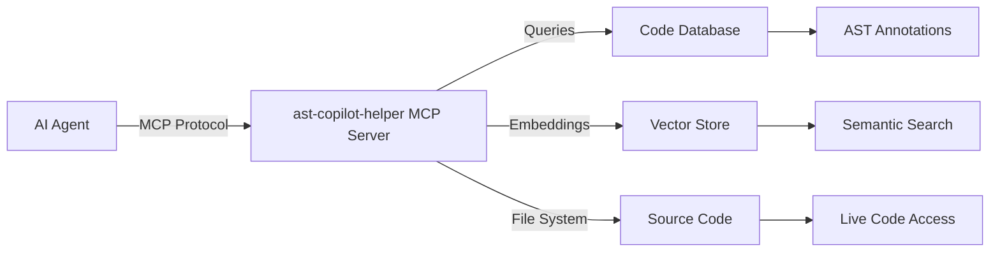

# AI Integration Guide

Unlock the full potential of ast-copilot-helper by integrating it with AI agents. This comprehensive guide covers Model Context Protocol (MCP) setup, AI agent connections, and advanced AI-powered workflows.

## Overview

ast-copilot-helper implements the Model Context Protocol (MCP) to enable AI agents to understand your codebase structure, navigate code relationships, and provide contextual assistance. This creates a seamless bridge between your code and AI-powered development tools.

### What You'll Achieve

🤖 **AI Code Understanding** - Let AI agents comprehend your entire codebase  
🔍 **Contextual Assistance** - Get relevant suggestions based on your actual code  
🚀 **Enhanced Development** - Speed up coding with AI that knows your patterns  
📊 **Intelligent Analysis** - Leverage AI for code review and optimization

## Model Context Protocol (MCP) Basics

### What is MCP?

The Model Context Protocol is a standard that allows AI agents to access external data sources and tools. ast-copilot-helper acts as an MCP server, providing your codebase information to AI clients.

**Benefits:**

- **Standardized Interface** - Works with any MCP-compatible AI agent
- **Real-time Access** - AI agents get up-to-date code information
- **Secure Communication** - Controlled access to your codebase
- **Rich Context** - Semantic understanding beyond simple text

### Architecture Overview



## MCP Server Setup

### Start the MCP Server

The MCP server can run in different transport modes depending on your AI client:

**STDIO Transport (Most Common):**

```bash
# For desktop AI clients like Claude Desktop
ast-helper server --transport stdio

# Verify server is running
echo '{"jsonrpc":"2.0","id":1,"method":"initialize","params":{}}' | ast-helper server --transport stdio
```

**HTTP Transport:**

```bash
# For web-based AI agents
ast-helper server --transport http --port 3001 --cors

# With authentication
ast-helper server --transport http --port 3001 --auth-token "your-secure-token"

# Check server status
curl http://localhost:3001/health
```

**Server-Sent Events (SSE):**

```bash
# For real-time streaming applications
ast-helper server --transport sse --port 3002
```

### Server Configuration

Create `.ast-helper.json` with MCP-specific settings:

```json
{
  "server": {
    "transport": "stdio",
    "port": 3001,
    "host": "localhost",
    "cors": {
      "enabled": true,
      "origins": ["https://claude.ai", "http://localhost:3000"],
      "methods": ["GET", "POST", "OPTIONS"]
    },
    "authentication": {
      "enabled": false,
      "method": "bearer",
      "token": "${MCP_AUTH_TOKEN}"
    },
    "rateLimit": {
      "enabled": true,
      "requests": 1000,
      "window": 3600
    }
  },
  "ai": {
    "embeddingModel": "text-embedding-3-small",
    "maxContextSize": 8192,
    "enableCaching": true
  }
}
```

## AI Agent Integration

### Claude Desktop Integration

Claude Desktop is one of the most popular MCP clients. Here's how to connect it with ast-copilot-helper:

#### Installation

1. **Download Claude Desktop:**

   - Visit [claude.ai/desktop](https://claude.ai/desktop)
   - Install for your platform (Windows, macOS, Linux)

2. **Configure MCP Server:**

   Create or edit Claude's MCP configuration file:

   **macOS:**

   ```bash
   # Edit configuration
   nano ~/Library/Application\ Support/Claude/claude_desktop_config.json
   ```

   **Windows:**

   ```bash
   # Edit configuration (PowerShell)
   notepad $env:APPDATA\Claude\claude_desktop_config.json
   ```

   **Linux:**

   ```bash
   # Edit configuration
   nano ~/.config/Claude/claude_desktop_config.json
   ```

3. **Add ast-copilot-helper Configuration:**

   ```json
   {
     "mcpServers": {
       "ast-copilot-helper": {
         "command": "ast-helper",
         "args": ["server", "--transport", "stdio"],
         "cwd": "/path/to/your/project"
       }
     }
   }
   ```

   **For specific projects:**

   ```json
   {
     "mcpServers": {
       "my-typescript-project": {
         "command": "ast-helper",
         "args": ["server", "--transport", "stdio"],
         "cwd": "/home/user/projects/my-app"
       },
       "python-ml-project": {
         "command": "ast-helper",
         "args": [
           "server",
           "--transport",
           "stdio",
           "--config",
           "ml-config.json"
         ],
         "cwd": "/home/user/ml-project"
       }
     }
   }
   ```

4. **Restart Claude Desktop** and verify the connection by asking:
   > "What functions are available in my codebase?"

#### Verification

Test the integration:

```
You: Can you analyze my authentication system?

Claude: I can see your codebase through ast-copilot-helper. Let me search for authentication-related functions...

Found these authentication functions:
1. authenticateUser() in src/auth/login.ts
2. validateToken() in src/auth/middleware.ts
3. refreshToken() in src/auth/tokens.ts

Would you like me to analyze any specific aspect?
```

### Other AI Agents

#### Cursor IDE Integration

Cursor IDE supports MCP servers through extensions:

1. **Install ast-copilot-helper extension** (if available)
2. **Configure MCP server:**

   ```json
   // .cursor/settings.json
   {
     "mcp.servers": [
       {
         "name": "ast-copilot-helper",
         "command": "ast-helper",
         "args": ["server", "--transport", "stdio"],
         "cwd": "."
       }
     ]
   }
   ```

#### Continue.dev Integration

For Continue.dev (VS Code AI extension):

```typescript
// ~/.continue/config.ts
export default {
  mcp: [
    {
      name: "ast-copilot-helper",
      command: "ast-helper",
      args: ["server", "--transport", "stdio"],
      cwd: process.cwd(),
    },
  ],
};
```

#### Custom AI Agents

For building your own AI agent with MCP support:

**Python Example:**

```python
import asyncio
from mcp import Client

async def main():
    # Connect to MCP server
    client = Client()
    await client.connect("stdio", ["ast-helper", "server", "--transport", "stdio"])

    # Query codebase
    response = await client.call_tool("query_codebase", {
        "query": "authentication functions",
        "limit": 10
    })

    print(f"Found {len(response['results'])} functions")
    for result in response['results']:
        print(f"- {result['name']} in {result['file']}")

if __name__ == "__main__":
    asyncio.run(main())
```

**Node.js Example:**

```javascript
import { Client } from "@modelcontextprotocol/sdk/client";

async function queryCodebase() {
  const client = new Client();

  await client.connect({
    command: "ast-helper",
    args: ["server", "--transport", "stdio"],
  });

  const response = await client.callTool("query_codebase", {
    query: "database operations",
    type: "function",
  });

  console.log("Database functions:", response.results);
}

queryCodebase().catch(console.error);
```

## MCP Server Capabilities

### Available Tools

ast-copilot-helper exposes these MCP tools to AI agents:

#### 1. `query_codebase`

Search your codebase using natural language:

```json
{
  "name": "query_codebase",
  "arguments": {
    "query": "authentication middleware functions",
    "type": "function",
    "limit": 10,
    "similarity_threshold": 0.7
  }
}
```

**Response:**

```json
{
  "results": [
    {
      "id": "func_authenticateUser_123",
      "name": "authenticateUser",
      "type": "function",
      "file": "src/auth/middleware.ts",
      "line": 15,
      "description": "Middleware to authenticate user requests",
      "score": 0.89
    }
  ]
}
```

#### 2. `get_file_content`

Retrieve source code for specific files:

```json
{
  "name": "get_file_content",
  "arguments": {
    "file_path": "src/auth/middleware.ts",
    "start_line": 15,
    "end_line": 35
  }
}
```

#### 3. `get_function_details`

Get detailed information about specific functions:

```json
{
  "name": "get_function_details",
  "arguments": {
    "function_id": "func_authenticateUser_123"
  }
}
```

**Response:**

```json
{
  "name": "authenticateUser",
  "file": "src/auth/middleware.ts",
  "line": 15,
  "parameters": [
    { "name": "req", "type": "Request" },
    { "name": "res", "type": "Response" },
    { "name": "next", "type": "NextFunction" }
  ],
  "return_type": "Promise<void>",
  "description": "Middleware to authenticate user requests",
  "source_code": "async function authenticateUser(req, res, next) { ... }"
}
```

#### 4. `analyze_dependencies`

Understand code relationships and dependencies:

```json
{
  "name": "analyze_dependencies",
  "arguments": {
    "file_path": "src/auth/middleware.ts"
  }
}
```

#### 5. `get_project_structure`

Get overview of project organization:

```json
{
  "name": "get_project_structure",
  "arguments": {
    "max_depth": 3
  }
}
```

### Available Resources

MCP resources provide persistent access to codebase information:

#### Code Database Resource

```
resource://ast-helper/database
```

Provides access to the complete parsed codebase with metadata, annotations, and relationships.

#### Project Configuration Resource

```
resource://ast-helper/config
```

Exposes current ast-copilot-helper configuration including parsing rules, AI settings, and project metadata.

## AI-Powered Workflows

### Code Understanding and Exploration

**Workflow: Understanding New Codebase**

```
You: I'm new to this codebase. Can you help me understand the authentication system?

Claude: I'll analyze your authentication system using ast-copilot-helper. Let me search for auth-related code...

[MCP Query: "authentication login security middleware"]

I found your authentication system consists of:

1. **Core Authentication (src/auth/)**
   - login.ts: User login logic
   - middleware.ts: Request authentication
   - tokens.ts: JWT token management

2. **Key Functions:**
   - authenticateUser(): Main auth middleware
   - validateToken(): Token validation
   - refreshToken(): Token renewal

3. **Security Features:**
   - JWT tokens with expiration
   - Role-based access control
   - Password hashing with bcrypt

Would you like me to explain any specific part in detail?
```

### Code Review and Analysis

**Workflow: Security Review**

```
You: Please review my authentication code for security issues

Claude: I'll perform a security analysis of your authentication system...

[MCP Analysis of auth functions]

Security Review Results:

✅ **Good Practices Found:**
- Passwords are hashed with bcrypt
- JWT tokens have proper expiration
- Input validation on login endpoints

⚠️ **Potential Issues:**
1. **Token Storage**: Tokens might be stored in localStorage (vulnerable to XSS)
2. **Rate Limiting**: No rate limiting on login attempts
3. **Session Management**: No session invalidation on logout

**Recommendations:**
1. Implement httpOnly cookies for token storage
2. Add rate limiting middleware
3. Create proper logout with token blacklisting

Would you like me to show you how to implement these improvements?
```

### Refactoring Assistance

**Workflow: Code Refactoring**

```
You: I want to refactor my user management system to use better patterns

Claude: Let me analyze your current user management code...

[MCP Query: "user management CRUD operations"]

I found your user management in:
- src/users/controller.ts: CRUD operations
- src/users/service.ts: Business logic
- src/users/model.ts: Data model

Current pattern analysis:
- Controllers are handling business logic (should be in services)
- No proper error handling abstractions
- Duplicate validation logic

**Refactoring Plan:**

1. **Separate Concerns:**
   - Move business logic from controllers to services
   - Create dedicated validation layer
   - Implement error handling middleware

2. **Improve Structure:**
```

src/users/
├── controller.ts # HTTP handling only
├── service.ts # Business logic
├── validation.ts # Input validation
├── model.ts # Data access
└── types.ts # Type definitions

```

Would you like me to show the refactored code for any specific file?
```

### Documentation Generation

**Workflow: API Documentation**

````
You: Generate API documentation for my user endpoints

Claude: I'll analyze your user API endpoints and generate documentation...

[MCP Query: "API endpoints user routes"]

# User API Documentation

## Overview
Your user API provides CRUD operations for user management with authentication.

## Endpoints

### POST /api/users
**Purpose:** Create a new user
**Authentication:** Admin required
**Request Body:**
```typescript
{
  email: string;
  password: string;
  role?: 'user' | 'admin';
}
````

**Response:**

```typescript
{
  id: string;
  email: string;
  role: string;
  createdAt: string;
}
```

[Additional endpoints...]

This documentation was generated by analyzing your actual code structure. Would you like me to add more details or export this in a specific format?

```

## Advanced AI Features

### Semantic Code Search

AI agents can perform sophisticated searches using natural language:

```

Examples of AI-powered queries:

"Find functions that handle file uploads"
"Show me error handling patterns in the API layer"
"Where do we validate user input?"
"Functions that interact with the database"
"Components that manage user authentication state"

```

### Code Pattern Recognition

AI can identify and analyze patterns in your codebase:

```

AI Analysis Examples:

"Analyze error handling patterns across the codebase"
"Find inconsistent naming conventions"
"Identify functions that might need refactoring"
"Show me all singleton patterns in the code"
"Find potential security vulnerabilities"

```

### Context-Aware Suggestions

AI provides suggestions based on actual code context:

```

Context-Aware Examples:

You: "How should I handle errors in my new payment service?"

Claude: Based on your existing error handling patterns, I see you use:

1. Custom error classes (PaymentError, ValidationError)
2. Centralized error middleware in src/middleware/error.ts
3. Structured error responses with error codes

For your payment service, follow the same pattern:
[Shows specific code examples from your codebase]

````

## Performance and Optimization

### Server Performance

**Monitor MCP Server Performance:**

```bash
# Start server with performance monitoring
ast-helper server --transport http --verbose --profile

# Check memory usage
ps aux | grep ast-helper

# Monitor query response times
curl -w "%{time_total}" http://localhost:3001/health
````

**Optimize for Large Codebases:**

```json
{
  "performance": {
    "maxWorkers": 4,
    "chunkProcessing": true,
    "lazyLoading": true
  },
  "ai": {
    "batchSize": 50,
    "enableCaching": true,
    "cacheExpiry": 3600
  }
}
```

### AI Query Optimization

**Efficient Query Patterns:**

```bash
# ✅ Good - Specific queries
"authentication middleware functions"
"database connection utilities"
"React component hooks"

# ❌ Avoid - Too broad
"functions"
"all code"
"everything"
```

**Use Type Filters:**

```json
{
  "query": "user management",
  "type": "function", // Focus on functions only
  "file_pattern": "src/user/**", // Specific directory
  "limit": 10 // Reasonable limit
}
```

## Security Considerations

### Authentication

**Enable Authentication for Production:**

```json
{
  "server": {
    "authentication": {
      "enabled": true,
      "method": "bearer",
      "token": "${MCP_AUTH_TOKEN}"
    }
  }
}
```

**Generate Secure Tokens:**

```bash
# Generate secure token
openssl rand -base64 32 > .mcp-token

# Set environment variable
export MCP_AUTH_TOKEN=$(cat .mcp-token)
```

### Network Security

**Restrict CORS Origins:**

```json
{
  "server": {
    "cors": {
      "origins": ["https://claude.ai", "https://your-domain.com"]
    }
  }
}
```

**Use HTTPS in Production:**

```bash
# Behind reverse proxy (nginx, apache)
ast-helper server --transport http --host 127.0.0.1 --port 3001

# Configure nginx/apache for HTTPS termination
```

### Rate Limiting

**Protect Against Abuse:**

```json
{
  "server": {
    "rateLimit": {
      "enabled": true,
      "requests": 100, // Requests per window
      "window": 900, // 15 minutes
      "message": "Rate limit exceeded. Please try again later."
    }
  }
}
```

## Troubleshooting AI Integration

### Connection Issues

**MCP Server Not Starting:**

```bash
# Check if port is available
lsof -i :3001

# Test server manually
ast-helper server --transport stdio --verbose

# Check configuration
ast-helper config validate
```

**Claude Desktop Connection Issues:**

```bash
# Verify configuration file location
ls ~/Library/Application\ Support/Claude/claude_desktop_config.json  # macOS
ls ~/.config/Claude/claude_desktop_config.json                        # Linux

# Check ast-helper is in PATH
which ast-helper

# Test server command manually
cd /path/to/your/project
ast-helper server --transport stdio
```

### Performance Issues

**Slow Query Responses:**

```bash
# Check database size
ls -lh .ast-helper.db

# Optimize database
ast-helper analyze --optimize-db

# Reduce context size
ast-helper config set ai.maxContextSize 4096
```

**High Memory Usage:**

```json
{
  "performance": {
    "maxWorkers": 2,
    "maxMemory": "1GB"
  },
  "ai": {
    "batchSize": 25,
    "enableCaching": false
  }
}
```

### AI Agent Issues

**AI Not Understanding Codebase:**

1. **Verify MCP Connection:**

   ```
   Ask AI: "Can you see my codebase through MCP?"
   Expected: AI should list available tools/resources
   ```

2. **Check Parsing Status:**

   ```bash
   ast-helper query "*" --limit 5
   # Should return parsed code elements
   ```

3. **Test MCP Tools Manually:**
   ```bash
   echo '{"jsonrpc":"2.0","id":1,"method":"tools/list","params":{}}' | \
     ast-helper server --transport stdio
   ```

## Future AI Integration

### Emerging AI Platforms

**Preparing for New AI Agents:**

ast-copilot-helper's MCP implementation is designed to work with future AI platforms that support the Model Context Protocol standard.

**Integration Roadmap:**

- GitHub Copilot Workspace integration
- JetBrains AI Assistant support
- Visual Studio IntelliCode integration
- Custom AI agent frameworks

### Advanced Features in Development

**Enhanced AI Capabilities:**

- Code generation based on codebase patterns
- Automated test generation
- Refactoring suggestions with confidence scoring
- Security vulnerability detection
- Performance optimization recommendations

## Best Practices Summary

### Server Management

1. **Use appropriate transport** - STDIO for desktop clients, HTTP for web
2. **Enable authentication** in production environments
3. **Monitor performance** and optimize for your codebase size
4. **Configure rate limiting** to prevent abuse
5. **Use caching** to improve response times

### AI Agent Configuration

1. **Test connectivity** before production use
2. **Provide clear context** in AI queries
3. **Use specific queries** rather than broad searches
4. **Leverage type filters** to narrow results
5. **Monitor AI usage** and costs

### Security

1. **Secure API tokens** using environment variables
2. **Restrict CORS origins** to known clients
3. **Enable rate limiting** for public access
4. **Use HTTPS** for production deployments
5. **Regularly rotate** authentication tokens

## Next Steps

With AI integration configured:

- 🛠️ **[Developer Guide](../development)** - Contribute to AI integration features
- 📖 **[Troubleshooting Guide](../troubleshooting.md)** - Solve common AI integration issues
- 🚀 **[CLI Usage Guide](cli-usage)** - Master advanced CLI features for AI workflows
- ⚙️ **[Configuration Guide](configuration)** - Fine-tune AI and MCP settings

## AI Integration Quick Reference

### Essential Commands

```bash
# Start MCP server for Claude Desktop
ast-helper server --transport stdio

# Start HTTP server for web clients
ast-helper server --transport http --port 3001 --cors

# Test server connectivity
echo '{"jsonrpc":"2.0","id":1,"method":"initialize","params":{}}' | \
  ast-helper server --transport stdio
```

### Claude Desktop Config

```json
{
  "mcpServers": {
    "ast-copilot-helper": {
      "command": "ast-helper",
      "args": ["server", "--transport", "stdio"],
      "cwd": "/path/to/your/project"
    }
  }
}
```

### Security Settings

```bash
export MCP_AUTH_TOKEN="secure-token-here"
ast-helper server --auth-token "$MCP_AUTH_TOKEN"
```
